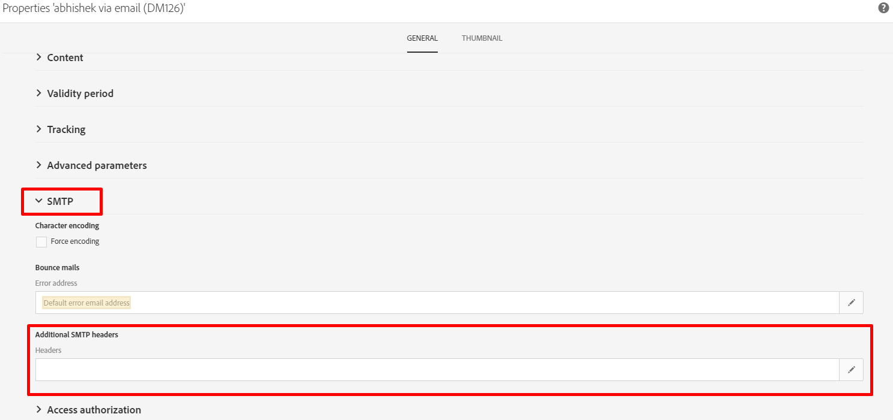

# ¿Qué es el encabezado List-Unsubscribe? ¿Y cómo se puede implementar esto en ACS?

## Descripción

<b>¿Qué es el encabezado List-Unsubscribe? </b>

El encabezado List-Unsubscribe es un encabezado de correo electrónico opcional que puede añadir a sus mensajes. Permite a los suscriptores ver un botón de cancelación de suscripción en el que pueden hacer clic si desean dejar de recibir su correo electrónico automáticamente.

La cancelación de la suscripción a una lista la utiliza [!DNL Gmail], [!DNL Outlook.com], y otros. Su objetivo es ayudar a reducir las quejas, ya que ofrece a los suscriptores un método diferente para cancelar la suscripción de forma segura sin afectar negativamente a su reputación de envío.

El encabezado List-Unsubscribe se confunde fácilmente con otras dos opciones que los suscriptores pueden utilizar para cancelar la suscripción de su correo electrónico.

La opción List-Unsubscribe no es:

- El botón de correo no deseado: Cuando se hace clic en el botón basura o correo no deseado, se activa una queja, lo que afecta negativamente a su reputación de envío.
- Vínculo de cancelación de suscripción dentro del creativo de correo electrónico: Normalmente, este vínculo está en el pie de página del creativo del HTML y está controlado por usted. Sin embargo, la funcionalidad List-Unsubscribe está controlada por el proveedor de buzones de correo, si la ha incluido en sus encabezados.

En otras palabras, piense en la opción List-Unsubscribe como tercer método para que los suscriptores se eliminen de su lista de correo. Y es una opción que ayuda a proteger su reputación al reducir potencialmente sus quejas.

El encabezado de correo electrónico List-Unsubscribe se define en RFC 2369.

## Resolución

<b>¿Y cómo se puede implementar esto en ACS?</b>

En ACS, solo es posible añadir un encabezado SMTP en la plantilla de envío (no se puede añadir directamente en la entrega).

Estos son los pasos a seguir:

1. Abra y edite las propiedades de la plantilla de envío

1. Haga clic en la sección SMTP y edite la [!UICONTROL Encabezados] from [!UICONTROL Encabezados SMTP adicionales]

   

1. Añada la siguiente línea de comandos

   ```
   List-Unsubscribe: mailto:bounce@subdomain?subject=unsubscribe%=escape(context.mimeMessageId)
   ```

   La dirección de correo electrónico *<b>bounce@subdomain</b>* representa la variable <b>dirección de ruta de retorno</b>
