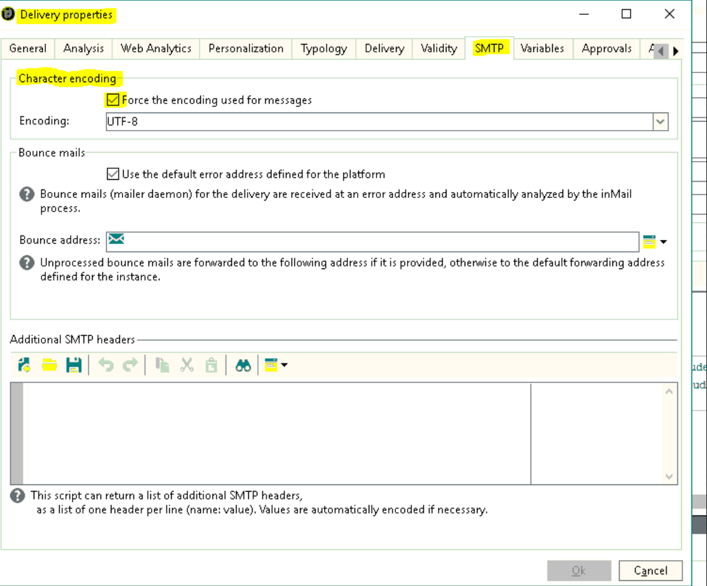

# Los conjuntos de caracteres de la opción de codificación de caracteres SMTP de Campaign no están visibles

## Descripción

<b>Entorno</b>

Adobe Campaign Classic

Adobe Campaign

<b>Problema</b>

Los conjuntos de caracteres de la opción de codificación de caracteres SMTP de Adobe Campaign en las propiedades de entrega no estaban visibles.

<b>Causa</b>

La causa es que la base de datos no es una base de datos Unicode.

## Resolución

<b>Solución</b>

1. La variable `XtkDatabaseId` en el campo de opciones define el ID de la base de datos.

   Comienza con una &quot;u&quot; para la base de datos Unicode. Consulte la [Lista de opciones del Campaign Classic](https://docs.adobe.com/content/help/en/campaign-classic/using/installing-campaign-classic/appendices/configuring-campaign-options.html) en nuestra documentación de Campaign Classic en Adobe Experience League para obtener más información.

   

   Esto significa que si el ID de la base de datos es Unicode, podría ver lo siguiente:

   

1. Al cambiar la variable `XtkDatabaseId` en el campo de opción, esa pieza no está visible como `IsUnicode()` parte de la condición para no cumplir en el código como se muestra a continuación:

   ```
   container type="visibleGroup" visibleIf="EV(@messageType, 'mail') and IsUnicode()"
                     xpath="advancedParameters"
            container label="Character encoding" type="frame"
              input useDesc="true" xpath="@forceCodepage"/
              container type="visibleGroup" visibleIf="@forceCodepage"
                input xpath="@codepage"/
              /container
            /container
          /container
   ```

1. En este ejemplo, la colaboración con la base de datos era `Latin1_General_CI_AS`.

   De ahí su `XtkDatabaseId` en el campo de opción no empezaba por usted, y ese es el motivo por el que la parte no está visible.

1. Para obtener más información sobre cómo cambiar a Unicode en bases de datos, consulte [Cambio a Unicode](https://docs.adobe.com/content/help/en/campaign-classic/using/monitoring-campaign-classic/updating-adobe-campaign/switching-to-unicode.html) en nuestra documentación de Campaign Classic en Adobe Experience League.
