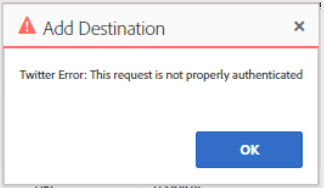

# AAM, sincronización de ID de Twitter o error de autenticación de devoluciones de destino

## Descripción

<b>Entorno</b>
Adobe Audience Manager

<b>Problema</b>
Al configurar una sincronización de Twitter ID o un destino dentro de AAM, los usuarios reciben este error de autenticación:

## Resolución

<b>Solución</b>

Segmentos con (`+` `&` `,` `%` `:` `;` `@` `/` `=` `?` `$`) en su nombre no se puede asignar a un destino de Twitter, debido a limitaciones en la API de Twitter.

Al crear el destino de Twitter (o al asignar nuevos segmentos a un destino de Twitter existente), asegúrese de seleccionar solo los segmentos que no tengan estos caracteres.

Si es necesario enviar un segmento a Twitter y tiene estos caracteres en el título, cambie el nombre del segmento antes de asignarlo a Twitter.

[Haga clic aquí para obtener más información](https://experienceleague.adobe.com/docs/audience-manager/user-guide/features/destinations/device-based/twitter-tailored-audiences.html?lang=en#segment-mapping-considerations) en nuestra Guía de Adobe Audience Manager en Adobe Experience League.
