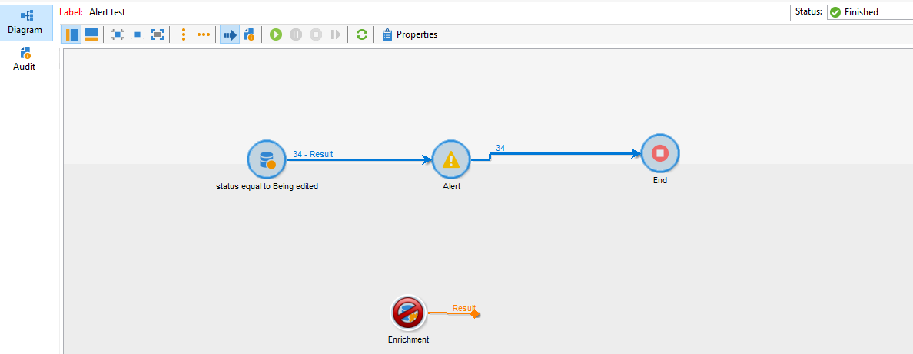
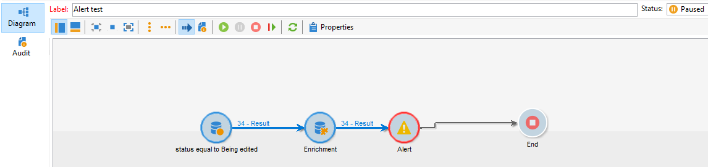
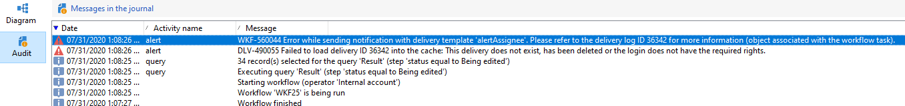

# La actividad de alerta falla cuando se agrega actividad de enriquecimiento después de una consulta en la tabla de entrega

## Descripción

<b>Entorno</b>  Campaign Classic     <b>Problema/Síntomas</b>  La actividad Alert falla cuando se agrega una actividad enrichment después de una actividad query .  

## Resolución

Para resolver el problema, NEO-25157 se creó para I+D, y el problema se ha solucionado desde entonces en la compilación 9330.
<b>Causa</b>

Este es un error conocido en la versión 9032, donde se agrega una actividad de enriquecimiento cuando se realiza una consulta<b> </b>se realiza en la tabla de entrega en el estado de entrega. Si el enriquecimiento hace algo o no, la actividad de alerta falla

Éxito sin enriquecimiento:

Fallo en el enriquecimiento:

Registros de auditoría: <b>*No se pudo cargar el ID de entrega \*\*\*\*\* en la caché:....</b>*

