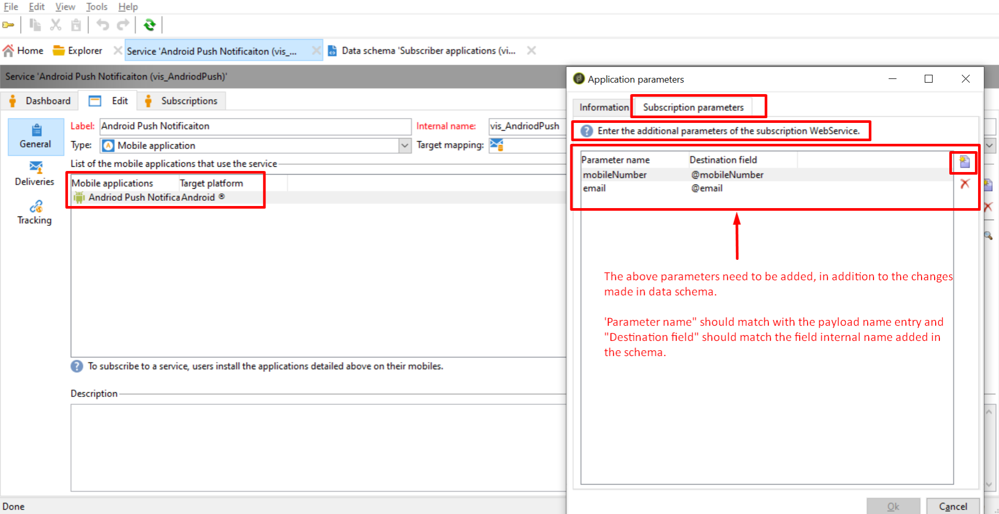
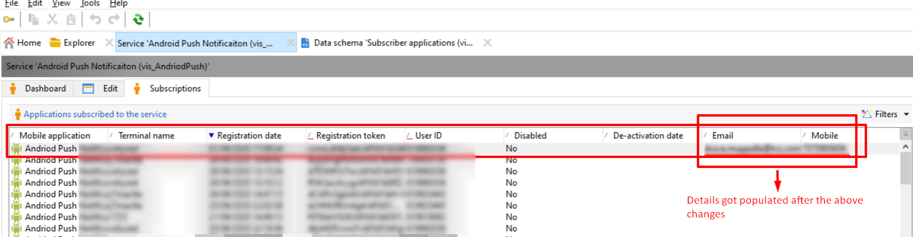

# Los parámetros adicionales no se rellenan en la aplicación Rcp ACC

## Descripción

Hemos ampliado la tabla Rcp de suscripción a la aplicación. Cuando intentamos insertar valores utilizando pares de clave-valor utilizando parámetros adicionales en los métodos de registro de dispositivos, solo se actualizan el token del dispositivo y la clave de usuario. Por favor, verifique esto y aconseje por qué los datos no se rellenan.

## Resolución

Como vimos, al agregar los parámetros adicionales en la aplicación móvil &quot;Servicios y suscripciones&quot;, pudimos rellenar los detalles de correo electrónico y número de teléfono.

