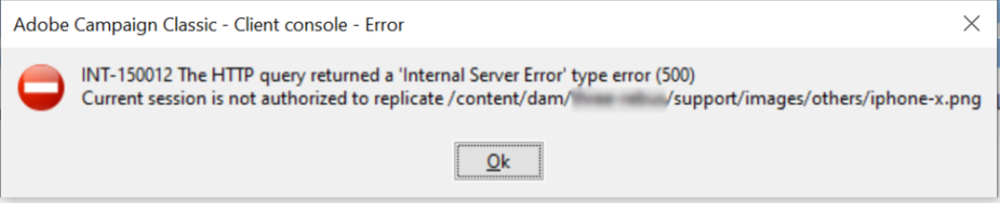

# AEM plantilla recuperada de [!DNL Campaign] consola

## Descripción


Descripción del problema = Al sincronizar plantillas de AEM a [!DNL Campaign], obtenemos el siguiente error:

```
 INT-150012 The HTTP query returned a 'Internal Server error' type error (500)
 Current session is not authorized to replicate /content/dam/xxx/support/images/others/ophone-x.png

 The following errors are generated on the AEM 1 and Campaign layers 2 respectively:
 1
 03.08.2020 11:21:12.517 \*WARN\* qtp1229648141-8634 com.adobe.ams.environment.indicator.wcm.impl.AemEnvironmentIndicatorFilter not accepted for uri /mnt/overlay/granite/ui/content/shell/header/actions/pulse.data.json
 03.08.2020 11:21:14.038 \*WARN\* qtp1229648141-8819 com.adobe.ams.environment.indicator.wcm.impl.AemEnvironmentIndicatorFilter not accepted for uri /content/campaigns/xxx/mobile/xxx/samsung-note9.campai
 gn.link.json
 03.08.2020 11:21:14.046 \*ERROR\* 10.44.3.4 1596453674038 POST /content/campaigns/xxx/mobile/xxx/samsung-note9.campaign.link.json HTTP/1.1 com.adobe.cq.mcm.campaign.servlets.LinkServlet Caught excepti
 on while serving link/unlink request
 java.lang.NullPointerException: null
        at com.adobe.cq.mcm.campaign.impl.NewsletterManagerImpl.link(NewsletterManagerImpl.java:113) com.day.cq.mcm.cq-mcm-campaign:1.3.14
        at com.adobe.cq.mcm.campaign.servlets.LinkServlet.handlePost(LinkServlet.java:76) com.day.cq.mcm.cq-mcm-campaign:1.3.14
        at com.adobe.cq.mcm.campaign.servlets.LinkServlet.doPost(LinkServlet.java:50) com.day.cq.mcm.cq-mcm-campaign:1.3.14
        at org.apache.sling.api.servlets.SlingAllMethodsServlet.mayService(SlingAllMethodsServlet.java:146) org.apache.sling.api:2.20.0

 2
 2020-08-05 05:56:17 Error during synchronization process
 2020-08-05 05:56:17 INT-150012 The HTTP query returned a 'Internal Server Error' type error (500) (iRc=-53)
```

## Resolución


Descripción del problema =





Es necesario conceder derechos de replicación al usuario AEM de la campaña, en AEM servidor.  Le dimos derechos de lectura/escritura/replicación al [!DNL Campaign]El usuario AEM en /content/campaign y /content/dam rutas donde estaban presentes los recursos de la campaña.
