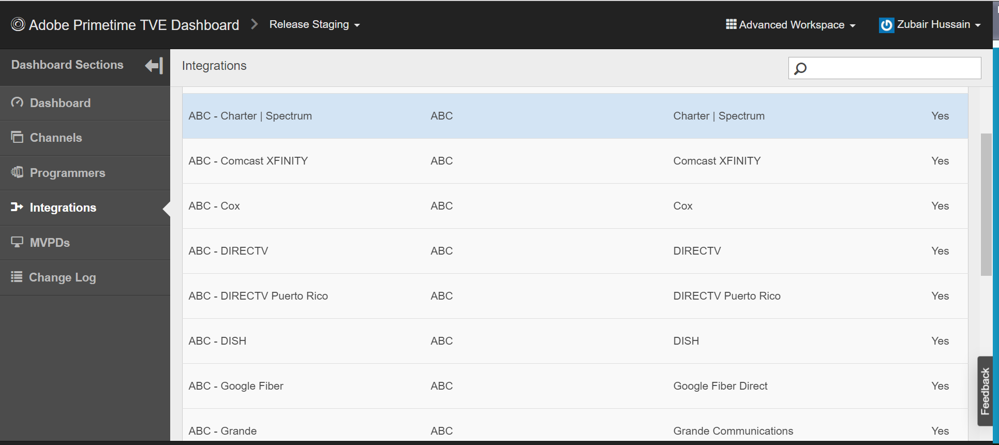
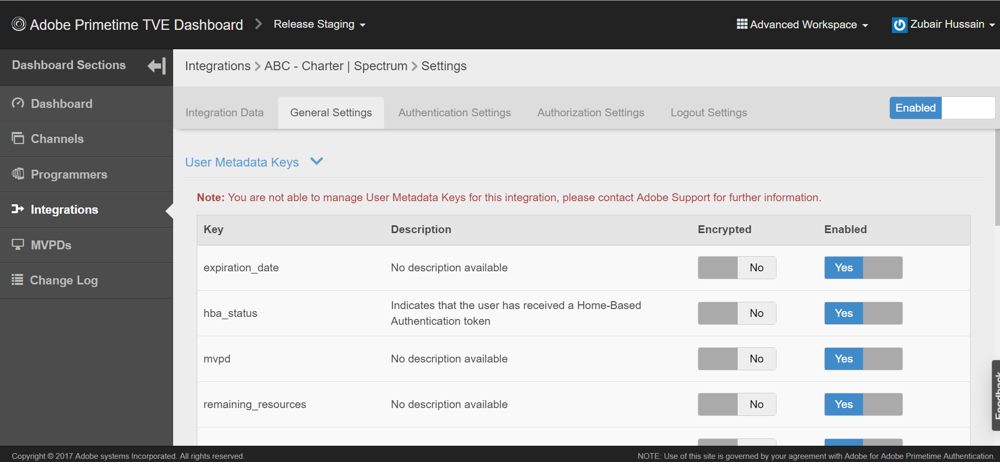
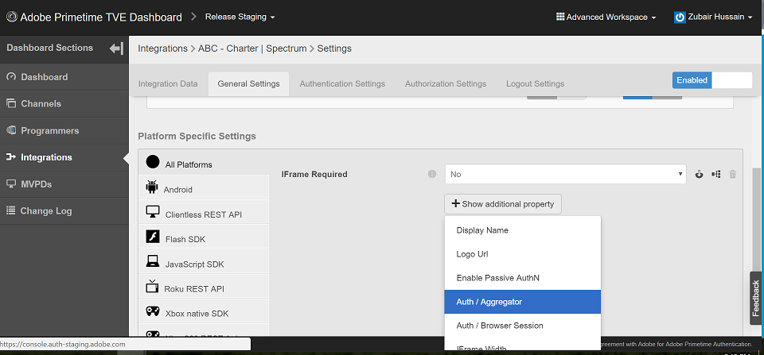

# ¿Cómo puedo confirmar si SSO está habilitado o deshabilitado para mi canal?

## Descripción

 Entorno  
Ensayo precualificado, Producción precualificada, Ensayo de versiones y producción de versiones

## Resolución

 SSO está habilitado de forma predeterminada para todas las integraciones, pero está configurado para que SSO esté deshabilitado.  Para confirmar si SSO está desactivado, puede revisar la integración en el panel de control de Televisión.  Los siguientes atributos se establecen en YES, si SSO se ha deshabilitado para una integración Canal - MVPD:  
1. Auth / Aggregator — SÍ
2. Habilitar autenticación pasiva — SÍ

Si la configuración no está definida o configurada en NO, SSO está disponible para la integración. Si cambia esta configuración a NO, también podrá habilitar SSO.  Puede encontrar estos ajustes en su integración específica (asegúrese de que el espacio de trabajo avanzado está seleccionado).
1. Haga clic en su integración específica en TVE Dashboard.
2. Seleccione la ficha Configuración general y desplácese hacia abajo.
3. Haga clic en el botón &quot;Mostrar propiedad adicional&quot; para ver el valor de Auth / Aggregator y Enable Passive AuthN. 
