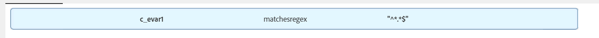

# Crear rasgo para capturar todos los valores en una variable c_evar1

## Descripción

   ¿Cómo se crea un rasgo para capturar todos los valores entrantes en AAM?   

## Resolución

Esto se puede lograr con la ayuda de &quot;Expresiones regulares&quot;.

Una condición como &quot;(c_evar1 coincide con chesregex &quot;\*.\*$&quot;)&quot; haría un rasgo para capturar todos los valores que entran en AAM. Esto actuará como &quot;si c_evar1 existe&quot;.

