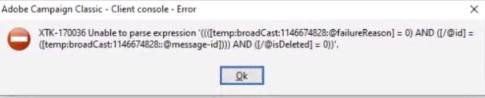
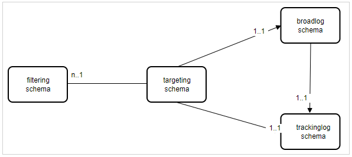

# Campaign Classic: Se genera un error al previsualizar un perfil de una entrega

## Descripción

Se ha informado de un problema al previsualizar un perfil seleccionando la opción &quot;Población de objetivo de envío&quot; en la previsualización de un envío. Básicamente, se genera el siguiente error al hacerlo:

## Resolución

El problema es el uso de una asignación de destino basada en un esquema de destinatario extendido donde los esquemas de registro de envío y registro de seguimiento no se han ampliado para el mismo. Una asignación de destino debe ser única en términos de esquema de destinatario frente a esquemas de registro de envío/registro de seguimiento.

Es imposible utilizar varios esquemas de segmentación con el mismo esquema trackinglog, ya que el flujo de trabajo de seguimiento no puede conciliar los datos con el id de segmentación.

Si el cliente no desea utilizar la asignación de destino OOB (con nms:recipient), se recomiendan dos métodos:

- Si desea utilizar una dimensión de segmentación personalizada, debe crear esquemas broadLog/trackingLog personalizados utilizando nms:broadlog como plantilla (c.f nms:broadLogRcp, nms:broadLogSvc, etc.)

   - esquema de segmentación: cus:recipient (extendido desde nms:recipient o totalmente personalizado)
   - esquema de registro de emisión: cus:broadLogRcp (extendido desde nms:broadLogRcp o totalmente personalizado)
   - esquema de registro de seguimiento: cus:trackingLogRcp (extendido desde nms:broadLogRcp o totalmente personalizado)
- Si desea utilizar OOB trackingLogRcp/broadLogRcp, <b>la dimensión de segmentación debe ser nms:recipient y la dimensión de filtrado puede ser un esquema personalizado</b>
