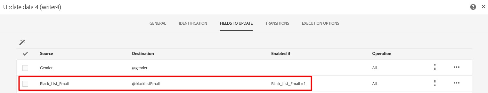
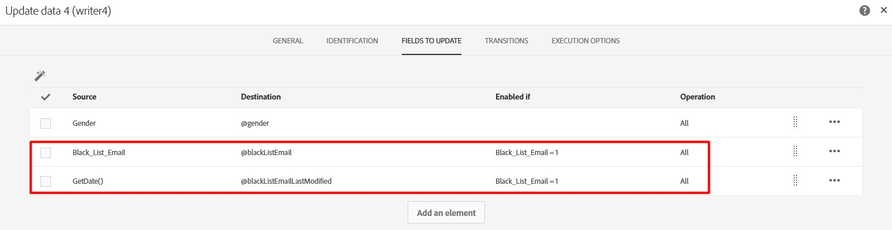

# blackListEmailLastModified se está modificando incluso cuando blacklistEmail no se modifica

## Descripción

| Caso de uso: al importar perfiles de un archivo, una de las propiedades clave que leen del archivo es blacklistEmail. Como se muestra a continuación, si utiliza una actualización condicional en el campo de origen para evitar actualizaciones innecesarias en el campo de destino.    Sin embargo, puede observar que el campo blackListEmailLastModified se modifica para todos los perfiles existentes que se importan. El comportamiento esperado es que blackListEmailLastModified solo debe modificarse cuando se modifique blacklistEmail.  Esta es la actualización SQL generada:  ACTUALIZAR NmsRecipient       SET iGender=COALESCE( OutTbl.Fld1084817585, 0),          iBlackListEmail=COALESCE( CASE OutTbl.iEnaFld1086062770 CUANDO 1 ENTONCES OutTbl.Fld1086062770 ELSE NULL END, CASE WHEN OutTbl.i EnaFld1086062770=1 ENTONCES 0 ELSE iBlackListEmail END),          iModifiedById=16107610,tsLastModified=$(curdate),          tsBlackListEmailLastModified=$(curdate),          tsBlackListAllLastModified=$(curdate)      DESDE wkf11373941_23_1 OutTbl     WHERE NmsRecipient.iRecipientId=OutTbl.iPKey_1       AND OutTbl.iRecProcState$(l)       AND OutTbl.iRecProcState=$(l)       AND OutTbl.iPKey_10  Como se muestra en la actualización anterior, el campo blackListEmailLastModified (tsBlackListEmailLastModified) se actualiza independientemente de si blacklistEmail (iBlackListEmail) se actualiza o no. |
| --- |

## Resolución

La solución es agregar el campo blackListEmailLastModified a la actualización condicional.

Consulte a continuación:

Y la actualización SQL generada muestra que blackListEmailLastModified solo se modifica cuando se modifica blacklistEmail.

ACTUALIZAR NmsRecipient SET iGender=COALESCE( OutTbl.Fld1084817585, 0), iBlackListEmail=COALESCE( CASE OutTbl.iEnaFld1086062770 CUANDO 1 ENTONCES OutTbl.iFld1086062770 ELSE NULL END, CASE WHEN OutTbl.iEnaFld1086062770=1 THEN 0 ELSE iBlackListEmail END), tsBlack ListEmailLastModified=COALESCE( CASE OutTbl.iEnaFld1169490137 CUANDO 1 ENTONCES OutTbl.tsFld1169490137 ELSE NULL END, CASE WHEN OutTbl iEnaFld1169490137=1 ENTONCES NULL ELSE tsBlackListEmailLastModified END), iModifiedById=16107610, tsLastModified=$(curdate), tsBlackListAllLastModified=$(curdate) DE wkf11373941_25_1 OutTbl WHERE NmsRecipient.iRecipientId=OutTbl.iPKey_1 Y OutTbl.iRecProcState$(l) Y OutRecTbl.iProcState=$(l) Y OutTbl.iPKey_10
