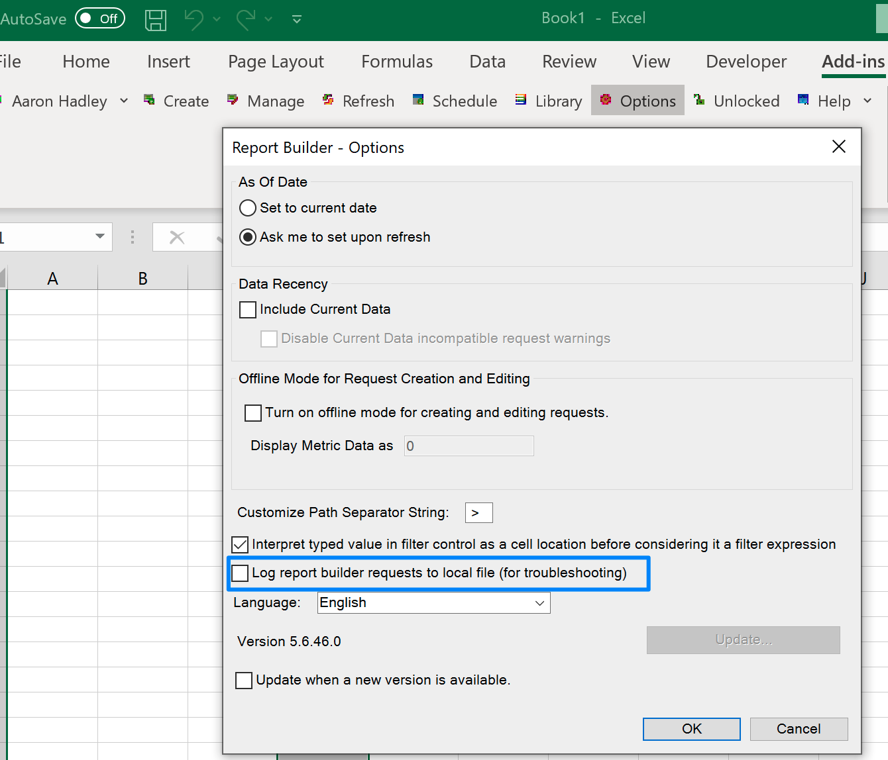
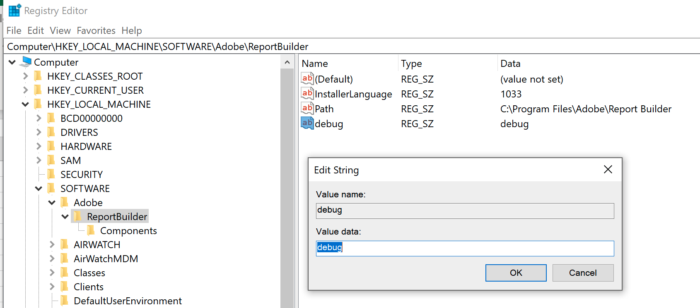

# [!DNL Analytics] - Registro detallado del Report Builder

## Descripción

¿Cómo puedo activar el inicio de sesión en ARB cuando no puedo iniciar sesión para marcar la casilla de registro?

## Resolución

Abrir el registro en Windows: [https://support.microsoft.com/en-us/windows/how-to-open-registry-editor-in-windows-10-deab38e6-91d6-e0aa-4b7c-8878d9e07b11](https://support.microsoft.com/en-us/windows/how-to-open-registry-editor-in-windows-10-deab38e6-91d6-e0aa-4b7c-8878d9e07b11)

Busque la carpeta una de las siguientes carpetas. La ruta y el nombre de archivo pueden ser un poco diferentes dependiendo de la versión de bits de ARB, etc.

`Computer\HKEY_LOCAL_MACHINE\SOFTWARE\WOW6432Node\Adobe\ReportBuilder`

OR

`Computer\HKEY_LOCAL_MACHINE\SOFTWARE\Adobe\ReportBuilder`

Clic con el botón derecho

Añadir nueva cadena

Proporcionar nombre de valor

Introducir datos de valor de `debug`

