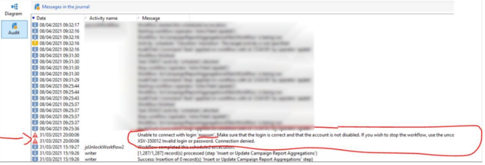
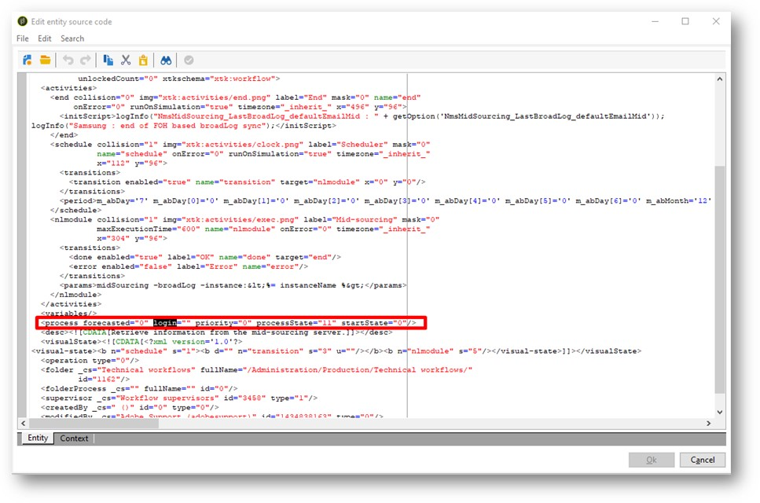

# ACC || usuario que impide que se ejecute WF

## Descripción

Uno de mis clientes tiene los flujos de trabajo que generan el informe se han detenido porque han deshabilitado un usuario que ha abandonado la empresa. Al deshabilitar al usuario de campaign classic en la administración de acceso, WF sigue generando un error. Intentaron volver a habilitar al usuario y ahora ejecutan el flujo de trabajo. Pero, ¿por qué se detuvo cuando deshabilité al usuario? ¿Y cómo puedo conseguir que siga trabajando una vez que lo deshabilita?

## Resolución

Pregunta con captura de pantalla —

Uno de mis clientes tiene los flujos de trabajo que generan el informe se han detenido porque han deshabilitado un usuario que ha abandonado la empresa. Al deshabilitar al usuario de campaign classic en la administración de acceso, WF sigue generando un error. Intentaron volver a habilitar al usuario y ahora ejecutan el flujo de trabajo. Pero, ¿por qué se detuvo cuando deshabilité al usuario? ¿Y cómo puedo conseguir que siga trabajando una vez que lo deshabilita?

¿Puede alguien sugerir si hay otra manera de eliminar al usuario para que el cliente pueda usar el WF?

Solución --

Siempre que se enfrenta a este error,

1. Abra el flujo de trabajo.
2. Haga clic en Editar código fuente XML ...
3. Buscar palabra clave <b>login=&quot;</b>
4. Encontrará un elemento en el XML como se muestra aquí
5. En su caso, el inicio de sesión tendrá algún valor<b>.</b>
6. Vacíe el atributo de inicio de sesión que desea hacer es <b>login=&quot;&quot;</b>
7. Haga clic en Aceptar para cerrar la ventana emergente.
8. Guarde el flujo de trabajo.
9. Reinicie el flujo de trabajo. Si el flujo de trabajo forma parte de una campaña (como ocurrirá en el 99 % de los casos), pida al usuario relevante del lado del cliente que reinicie este flujo de trabajo con su ID, desde la Campaign y no desde la carpeta Workflow.
10. Debe corregirse ahora.
11. Más tarde, puede ir a la carpeta Vista de flujos de trabajo y buscar <b>*mdata contains login=&quot;username&quot;</b>* para buscar otros flujos de trabajo de este tipo que puedan verse afectados.
12. Repita los pasos anteriores para cada uno.

Espero que esto ayude.
