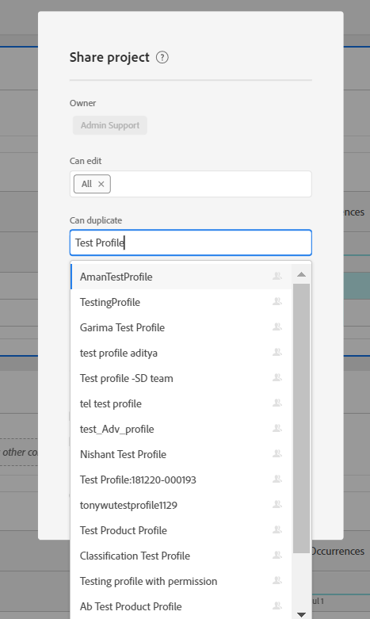
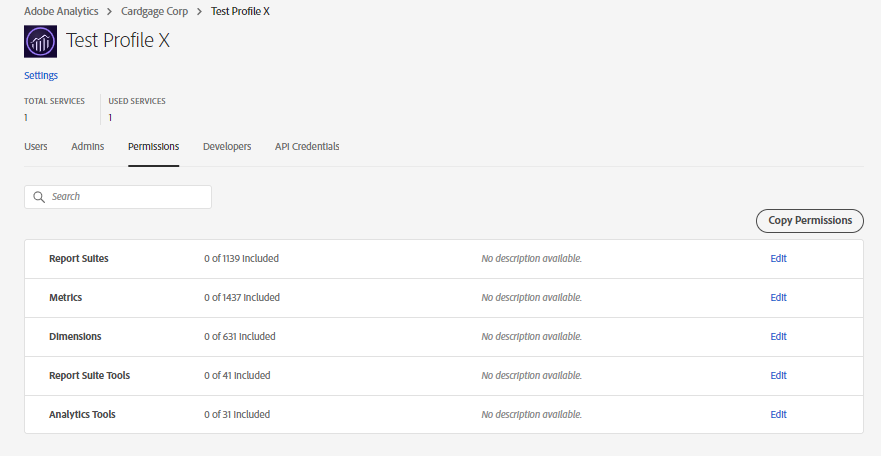
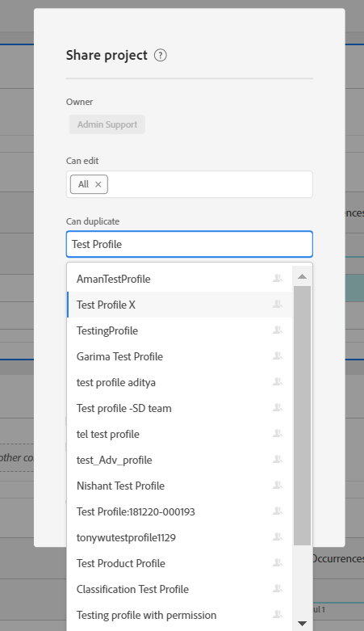
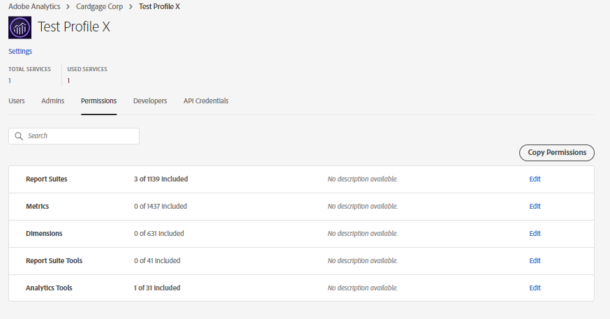

# Requisito previo para que un perfil de producto esté disponible mientras se comparte un proyecto de espacio de trabajo

## Descripción

Un perfil de producto indica que es posible que &#39;X&#39; no esté disponible en la lista desplegable mientras se comparte un proyecto de espacio de trabajo con usuarios de &#39;X&#39;.

## Resolución

Para que cualquier perfil de producto esté disponible en la lista desplegable mientras comparte un proyecto de espacio de trabajo, debe tener o tener permiso de Analytics asociado a él en Admin Console. Una vez que se agrega cualquier permiso aleatorio al perfil de producto &quot;X&quot;, el usuario debe comenzar a verlo en la lista desplegable mientras comparte cualquier proyecto de Workspace.

En el ejemplo anterior: Perfil de producto &#39;Perfil de prueba X&#39; no estaba disponible en la opción desplegable cuando se creó recientemente sin permisos. Sin embargo, cuando agregamos permisos, estaba disponible.

<b>Nota:</b> Si todos los permisos asignados al perfil de producto &#39;X&#39; se revocan en el Admin Console, el perfil de producto &#39;X&#39; se revocaría <b>keep </b>siga estando disponible en la lista desplegable para compartir proyecto.

     
