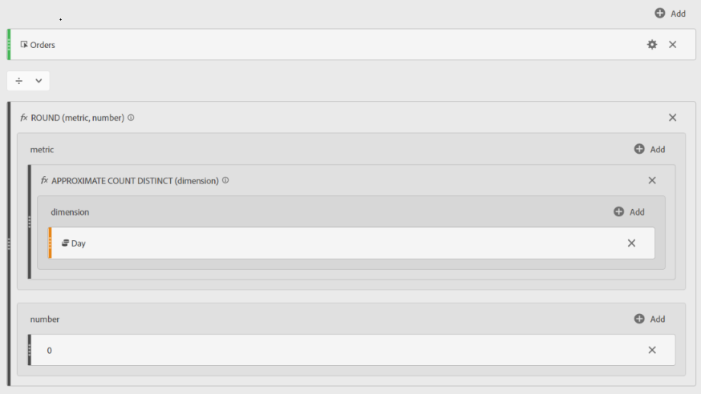

# Promedio de pedidos diarios en Adobe Analytics

## Descripción

Métrica calculada para encontrar el promedio de pedidos diarios en Adobe Analytics

## Resolución

<u><b>EXCLUSIÓN</b></u>: La siguiente métrica personalizada utiliza la función &quot;APROXIMATE COUNT DISTINCT&quot;. Como sugiere el nombre, esta no es una métrica con una precisión del 100 %, sin embargo, se garantiza que el resultado estará dentro del 5 % del valor real el 95 % del tiempo.

