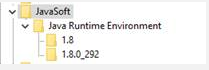
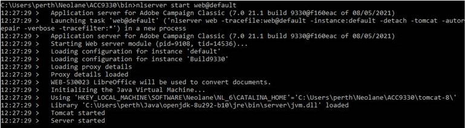
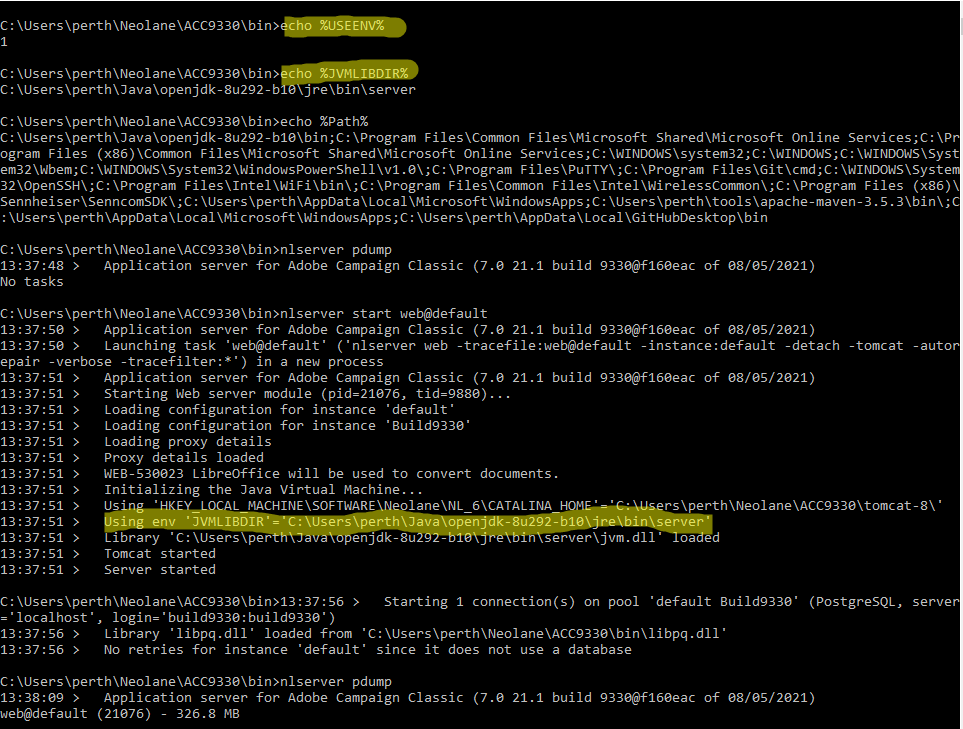

# JVM-510037 No se encuentra la biblioteca dinámica Java.

## Descripción


<b>Caso de uso</b> - Un cliente ha informado de un problema al reemplazar el Oracle JDK por Open JDK en las instancias de Campaign que se ejecutan en Windows.

Actualmente tienen instalado el Oracle JDK v1.8.0.191 en todas sus instancias de Windows Campaign. Sin embargo, después de reemplazar el Oracle JDK por Open JDK en una de sus instancias de Campaign, la WEB no ha podido comenzar con el siguiente error:

<b>`JVM-510037 Cannot find the Java dynamic library. Check that a JDK or a JRE is installed on the machine. (iRc=-53)`</b>

Sin embargo, Java se instala correctamente con las variables de entorno Path y JAVA_HOME correctas.


## Resolución


Para ejecutar el módulo web, la biblioteca dinámica de JVM debe ser visible para Campaign. Al eliminar el JDK de Oracle, se elimina la clave de JavaSoft del registro de Windows y también se pierden las referencias a esa biblioteca de JVM.

Hay dos soluciones para resolver este problema:

1) Puede agregar manualmente la clave de JavaSoft al registro de Windows en Computer\HKEY_LOCAL_MACHINE\SOFTWARE.



Este es un ejemplo (con OpenJDK 1.8_292) de lo que debe añadir:

`Windows Registry Editor Version 5.00`

`HKEY_LOCAL_MACHINE\SOFTWARE\JavaSoft`


```
HKEY_LOCAL_MACHINE\SOFTWARE\JavaSoft\Java Runtime Environment
"CurrentVersion"="1.8"
"BrowserJavaVersion"="11.301.2"
```


```
HKEY_LOCAL_MACHINE\SOFTWARE\JavaSoft\Java Runtime Environment\1.8
"MicroVersion"="0"
"RuntimeLib"="C:\\Users\\perth\\Java\\openjdk-8u292-b10\\jre\\bin\\server\\jvm.dll"
"JavaHome"="C:\\Users\\perth\\Java\\openjdk-8u292-b10\\jre"
```


```
HKEY_LOCAL_MACHINE\SOFTWARE\JavaSoft\Java Runtime Environment\1.8.0_292
"MicroVersion"="0"
"RuntimeLib"="C:\\Users\\perth\\Java\\openjdk-8u292-b10\\jre\\bin\\server\\jvm.dll"
"JavaHome"="C:\\Users\\perth\\Java\\openjdk-8u292-b10\\jre"
```


<br> 
Y la siguiente carpeta de ruta se ha agregado a la <b>Ruta </b>variable de entorno.

`C:\Users\perth\Java\openjdk-8u292-b10\bin`

El módulo web debe poder iniciarse como se espera:



2) Se puede definir el uso de dos variables de entorno de Windows para indicar dónde se encuentra el módulo Web el archivo jvm.dll.

Las variables son:

- USEENV=1
- JVMLIBDIR=*la ruta del archivo jvm.dll*


A continuación, se muestra un ejemplo:



Tenga en cuenta que el uso del JVMLIBDIR será visible desde el registro si el registro detallado está habilitado en el módulo Web.
