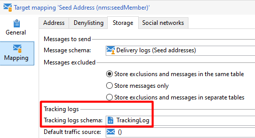

# El flujo de trabajo de seguimiento muestra el error PGS-220000 PostgreSQL: ERROR: la relación &quot;t1&quot; no existe

## Descripción


Después de una actualización de versión reciente 9343 o superior, puede experimentar los siguientes errores generados por el flujo de trabajo de seguimiento:


```
nlmodule    PGS-220000 PostgreSQL error: ERROR:  relation "t1" does not exist LINE 1: ...t, T3.iArticle, T2.iType FROM NmsTrackingUrl T2,  T1 LEFT OU... 
nlmodule    WDB-200001 SQL statement 'SELECT T1.tsLog, T1.iDeliveryId, T1.iUrlId, T1.sSourceType, T3.dAmount, T3.iArticle, T2.iType FROM NmsTrackingUrl T2,  T1 LEFT OUTER JOIN NmsWebTrackingLog T3 ON iTrackingLogId = iWebTrackingLogId WHERE T1.tsLog  :#(1)# AND T1.tsLog = :#(2)#  AND T1.iUrlId=T2.iTrackingUrlId ORDER BY T1.tsLog' could not be executed.   Param(0)=09/17/2020 8:55:00 PM   Param(1)=09/16/2020 8:55:00 PM
nlmodule    Attribute 'broadLog-id' unknown (see definition of schema 'Tracking logs (nms:trackingLog)').
```


## Resolución


Desde los registros de seguimiento detallados, vemos que el flujo de trabajo de seguimiento está fallando al final, de consolidar los datos:


```
00000000 00000000 1 info log Consolidating tracking logs for the period 09/16/2020 3:55:00 PM, 09/17/2020 3:55:00 PM...
00000000 00000000 1 info wdbc Select: 00000000  SELECT T1.tsLog, T1.iDeliveryId, T1.iUrlId, T1.sSourceType, T3.dAmount, T3.iArticle, T2.iType FROM NmsTrackingUrl T2, T1 LEFT OUTER JOIN NmsWebTrackingLog T3 ON iTrackingLogId = iWebTrackingLogId WHERE T1.tsLog  :#(1)# AND T1.tsLog = :#(2)# AND T1.iUrlId=T2.iTrackingUrlId ORDER BY T1.tsLog
00000000 00000000 2 info wdbc Param(0)=09/17/2020 8:55:00 PM
00000000 00000000 2 info wdbc Param(1)=09/16/2020 8:55:00 PM
00000000 00000000 1 error log PGS-220000 PostgreSQL error: ERROR: relation "t1" does not exist\nLINE 1: ...t, T3.iArticle, T2.iType FROM NmsTrackingUrl T2, T1 LEFT OU...\n \n. (iRc=-2006)
00000000 00000000 1 error log WDB-200001 SQL statement 'SELECT T1.tsLog, T1.iDeliveryId, T1.iUrlId, T1.sSourceType, T3.dAmount, T3.iArticle, T2.iType FROM NmsTrackingUrl T2, T1 LEFT OUTER JOIN NmsWebTrackingLog T3 ON iTrackingLogId = iWebTrackingLogId WHERE T1.tsLog  :#(1)# AND T1.tsLog = :#(2)# AND T1.iUrlId=T2.iTrackingUrlId ORDER BY T1.tsLog' could not be executed.\n Param(0)=09/17/2020 8:55:00 PM\n Param(1)=09/16/2020 8:55:00 PM (iRc=-2006)
```


Cada vez que se inicia el flujo de trabajo de seguimiento, extrae todas las asignaciones de destino y actualiza los datos en función de la configuración.

En este caso, una asignación de destino está causando el problema. Consulte a continuación:



Básicamente,<b> NMS: registro de seguimiento</b> El esquema NO debe utilizarse para los registros de monitorización porque el esquema no está relacionado con una tabla de base de datos (SQL).

En conclusión, el problema no tiene nada que ver con la actualización, sino con una mala configuración de asignación de destino.
