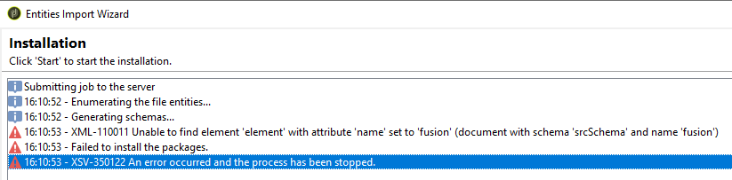
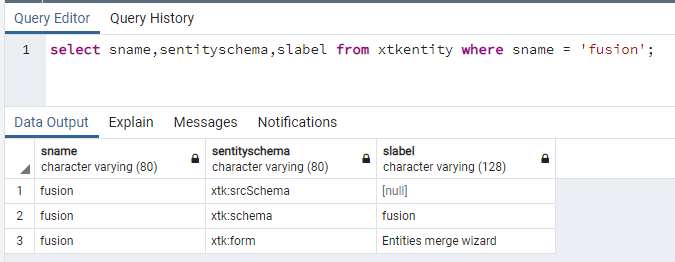
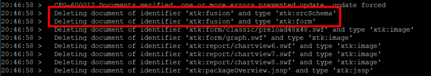

# Obtención de XML-110011 No se puede encontrar el elemento &quot;element&quot; con el atributo &quot;name&quot; configurado en &quot;fusión&quot; (documento con esquema)

## Descripción

<b>Para usuarios locales</b>     Después de actualizar una instancia de Campaign a la versión ACC-21.1 9342 o superior, cuando intento instalar cualquier paquete de Campaign, obtengo el siguiente error:     

## Resolución

El esquema de fusión (xtk:fusión) debe eliminarse en el proceso posterior a la actualización. Pero en algunos casos, el esquema sigue presente.

Cuando consulta la base de datos como se indica a continuación, puede ver los siguientes registros:

Para eliminar el esquema xtk:fusión, debe ejecutar la herramienta posterior a la actualización con la opción &quot;-force&quot;:

`nlserver config -postupgrade -allinstances -force`

Debería ver lo siguiente:

Si el esquema aún está presente, puede intentarlo con las opciones &quot;-force -Repair&quot;:

`nlserver config -postupgrade -allinstances -force -repair`

Si sigue sin funcionar, es posible que tenga que eliminar manualmente los registros de la base de datos.
