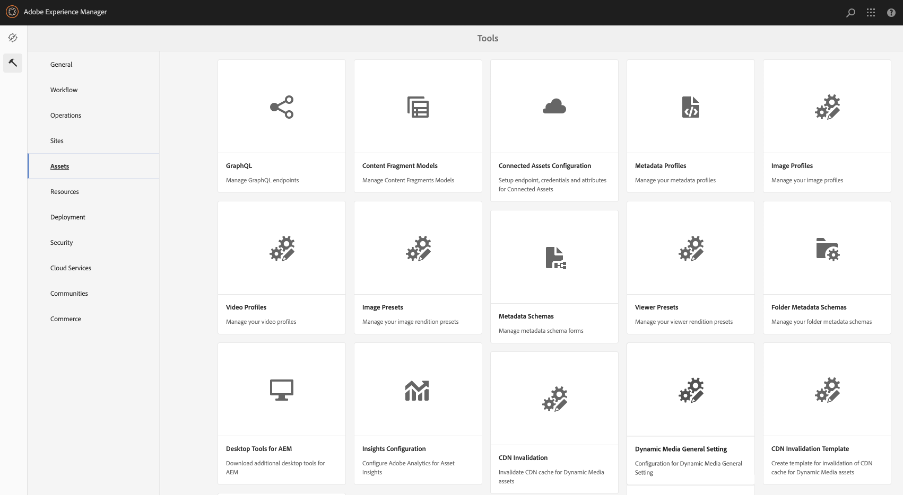
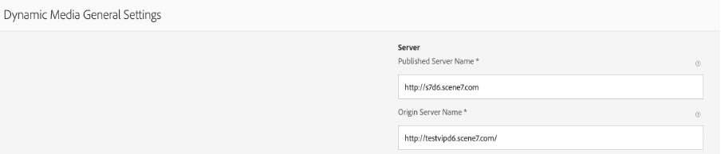
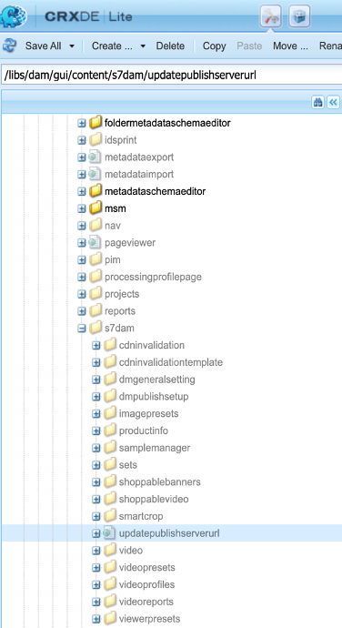
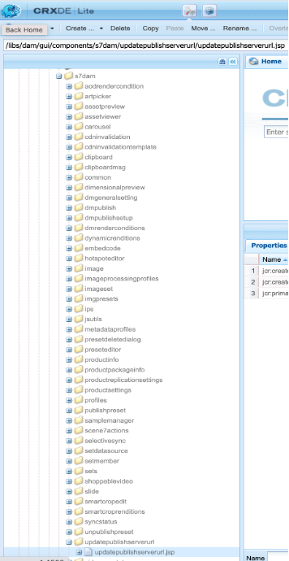
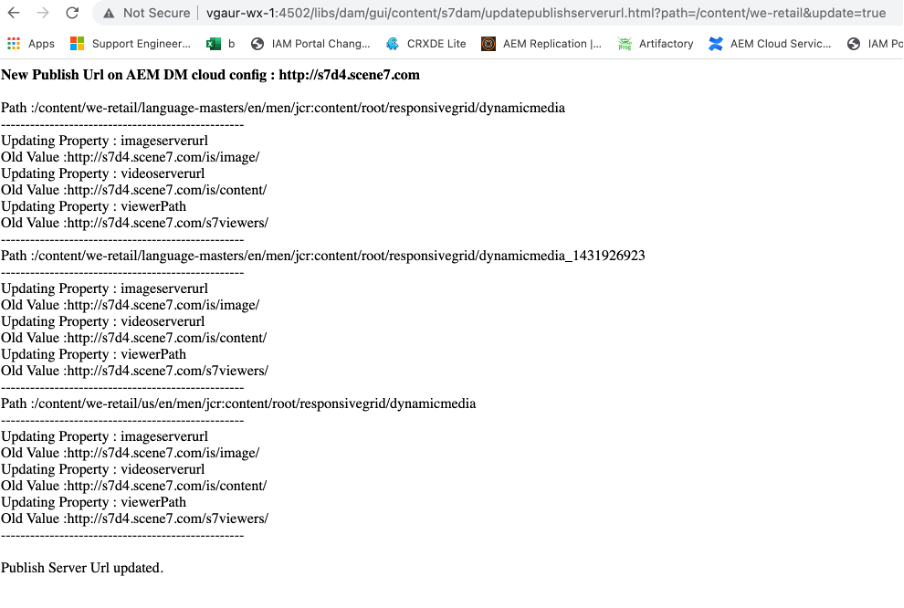
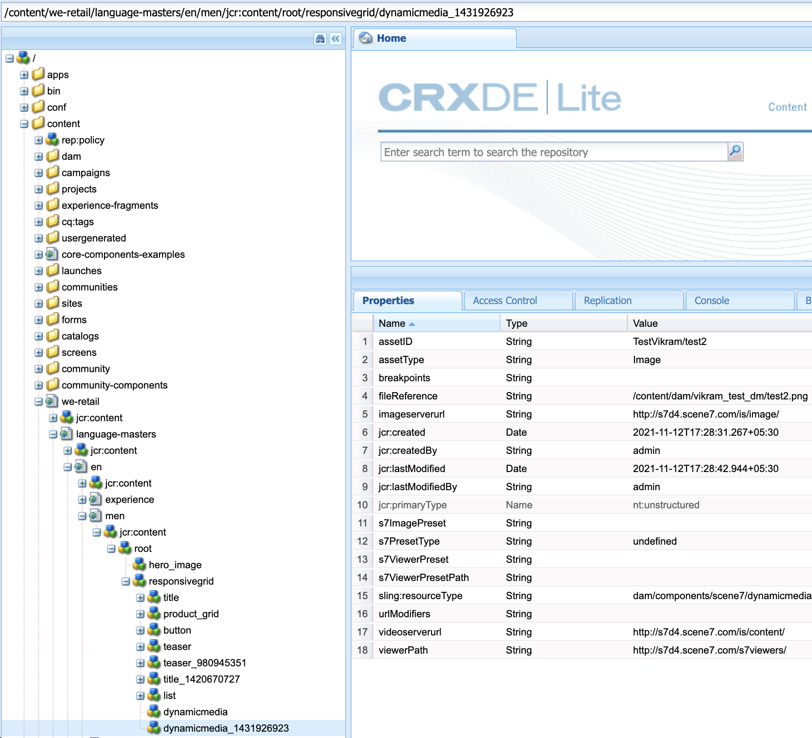
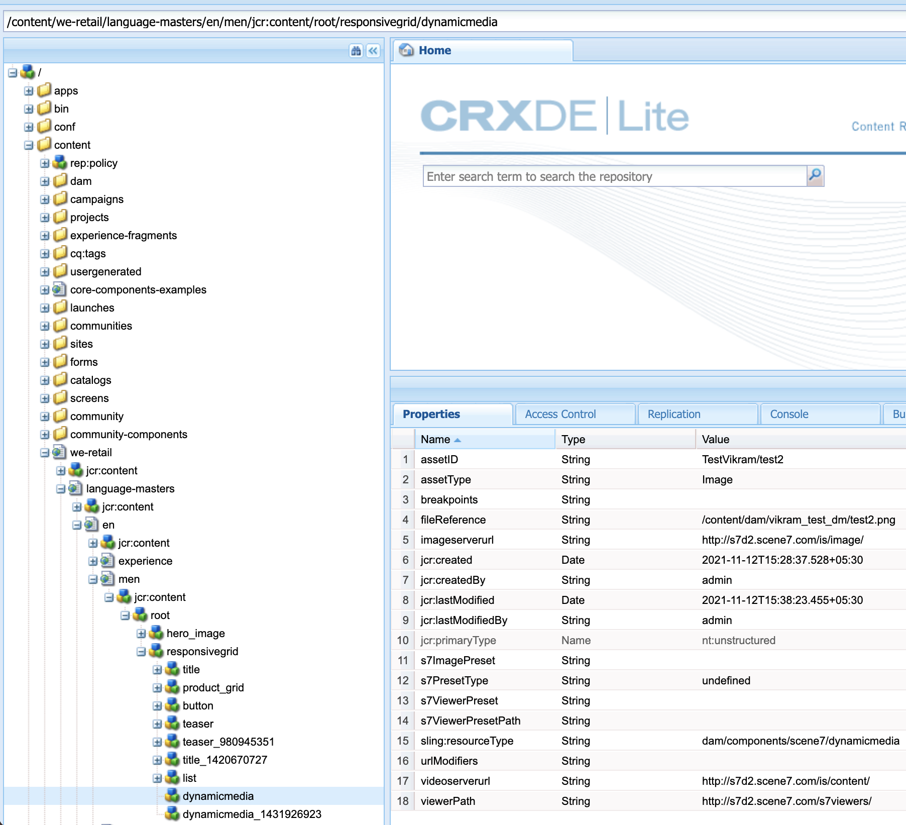

# Cambio de la URL de Dynamic Media para DM [!DNL Assets] (en el AEM 6.5.11 y posterior)

## Descripción

 En la instancia de autor de AEM (versión 6.5.11 y superior), puede usar la variable [!UICONTROL Configuración general] sección para configurar los ajustes del servidor DM y cambiar [!UICONTROL URL del servidor de publicación] o [!UICONTROL URL de Dynamic Media] para sus recursos de DM.

 Para abrir [!UICONTROL Configuración general de Dynamic Media] , en la instancia de autor de AEM, haga clic en <b>[!UICONTROL Herramientas] - [!UICONTROL Recursos] - [!UICONTROL Configuración general de Dynamic Media]</b>
         Asegúrese de haber configurado Dynamic Media en su instancia de autor de AEM, haga clic en [!UICONTROL Herramientas] - [!UICONTROL Cloud Services] - [!UICONTROL Configuración de Dynamic Media]

 El nombre del servidor publicado es un servidor de red de entrega de contenido (CDN) que se utiliza en todas las llamadas URL generadas por el sistema específicas de su cuenta de Dynamic Media.          Asegúrese de que su nombre de dominio personalizado esté asignado al servidor CDN de Adobe o, en caso de que esté utilizando el nombre de dominio de su propio proveedor de CDN, debe asignarse a nuestro [!UICONTROL Nombre del servidor de origen \*]

 \*Póngase en contacto con el servicio de asistencia técnica de Dynamic Media de Adobe para obtener más información.  

## Resolución

Una vez que haya cambiado el nombre del servidor publicado, guarde los cambios. No cambiar <b>Nombre del servidor de origen</b> a menos que un técnico de asistencia de Dynamic Media de Adobe le indique que lo haga.

Instrucciones para cambiar el nombre del servidor publicado para los componentes de Dynamic Media existentes en las páginas de Sitios :

- Instale el paquete adjunto para crear el nodo URL del servidor de publicación
- Una vez instalado el paquete, verá que se crean 2 archivos en su AEM Author

   - [/libs/dam/gui/content/s7dam/updatepublishserverurl](http://vgaur-wx-1:4502/crx/de/index.jsp#/crx.default/jcr%3aroot/libs/dam/gui/content/s7dam/updatepublishserverurl "Ver la ruta en el CRXDE Lite")
   - [/libs/dam/gui/components/s7dam/updatepublishserverurl/updatepublishserverurl.js](http://vgaur-wx-1:4502/crx/de/index.jsp#/crx.default/jcr%3aroot/libs/dam/gui/components/s7dam/updatepublishserverurl/updatepublishserverurl.jsp "Ver la ruta en el CRXDE Lite")p

.         

- Introduzca la ruta de AEM Sites en el parámetro &quot;path&quot; de esta URL : http://aem-server:portnumber/libs/dam/gui/content/s7dam/updatepublishserverurl.html?path=/content/mysite&amp;update=true
- Al servir esa dirección URL, se actualizarán automáticamente las direcciones URL de DM de todos los componentes de Dynamic Media en todas las páginas de sitios de la ruta de AEM Sites mencionada y se mostrará este tipo de salida

Todas las URL de los componentes de Dynamic Media serán cambios en el nuevo nombre del servidor publicado para su sitio AEM.
Esta es una vista del componente DM, que utiliza el antiguo nombre de servidor publicado

Esta es la vista del componente DM, el nombre del servidor publicado cambia después de visitar esta URL : http://aem-server:portnumber/libs/dam/gui/content/s7dam/updatepublishserverurl.html?path=/content/mysite&amp;update=true

Nota : Para obtener una lista de todos los componentes de Dynamic Media en la ruta de AEM Sites, puede llamar a esta URL : http://aem-server:portnumber/libs/dam/gui/content/s7dam/updatepublishserverurl.html?path=/content/mysite

