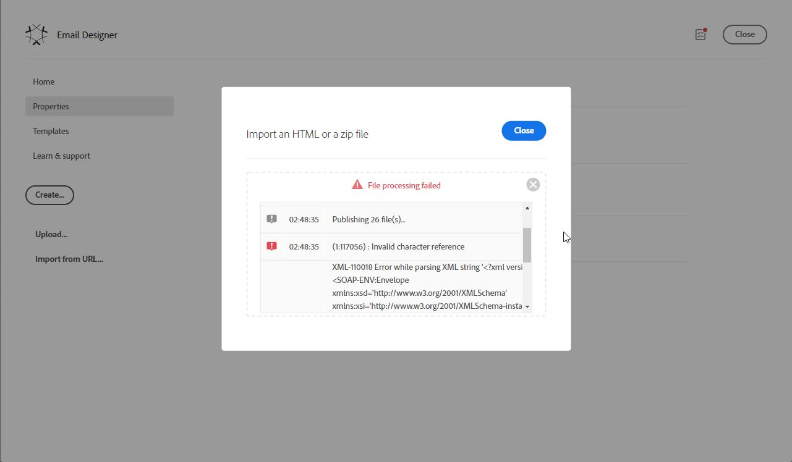

# Error al importar el html a [!UICONTROL Diseñador de correo electrónico]

## Descripción

<b>Problema:</b><br><br> <br><br>Durante la importación de un archivo .zip con un archivo HTML e imágenes en [!UICONTROL Diseñador de correo electrónico] se ha encontrado el siguiente error:<br><br> <br><br>

```
(1:117056) : Invalid character reference
XML-110018 Error while parsing XML string '?xml version='1.0'?SOAP-ENV:Envelope xmlns:xsd='http://www.w3.org/2001/XMLSchema' xmlns:xsi='http://www.w3.org/2001/XMLSchema-instance' xmlns:ns='urn:nms:contentModel' xmlns:SOAP-ENV='http://schemas.xmlsoap.org/soap/envelope/'SOAP-ENV:BodyExtractAndPatchContentResponse xmlns='urn:nms:contentModel' SOAP-ENV:encodingStyle='http://schemas.xmlsoap.org/soap/encoding/'pstrContent xsi:type='xsd:string'&lt;html xmlns=&quot;http://www.w3.org/1999/xhtml&quot;&#10; xmlns:v=&quot;urn:schemas-microsoft-com:vm'
```

<br><br> <br><br>

## Resolución


<b>Motivo:</b>

El archivo HTML contenía el carácter ASCII 0x03. Una vez eliminado el carácter del archivo HTML, la importación funcionó.
