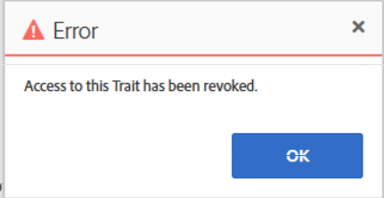
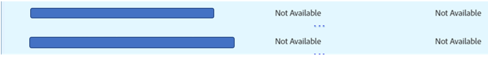

# Audience Manager: Solución de problemas de los modelos en AAM interfaz de usuario cuando no se pueden guardar ni obtener errores

## Descripción

<b>Detalle de la pregunta: </b>

<b>Pregunta 1:</b> No puede guardar el modelo en AAM interfaz de usuario del cliente aunque no se haya alcanzado el límite de modelos. Además, mientras guarda el modelo, no se obtiene ningún error. Al hacer clic en el botón &quot;Guardar&quot;, no sucedería nada.

<b>Pregunta 2: </b>No puede desactivar ni eliminar el modelo en AAM interfaz de usuario del cliente. Al desactivar o eliminar, aparece el error &quot;El acceso a este rasgo se ha revocado&quot;, en la captura de pantalla siguiente.

## Resolución

<b>Respuesta 1:</b> Compruebe todos los rasgos utilizados por los segmentos en el modelo. Es posible que encuentre un rasgo tomado del Audience Marketplace, pero que una suscripción para modelado no esté habilitada para los rasgos que utiliza en su modelo. En este caso, no podrá guardar el modelo. Para guardar el modelo, elimine todos esos rasgos o habilite la suscripción para el modelado de estos rasgos. Tenga en cuenta que, en caso de que desee habilitar la suscripción para el modelado, es posible que deba pagar cargos adicionales por ello.

<b>Respuesta 2: </b>Una de las posibles maneras de superar este problema:

Compruebe todos los rasgos utilizados por los segmentos en el modelo que desea desactivar o eliminar. Podría haber la posibilidad de que encuentre el rasgo que no está disponible en la captura de pantalla siguiente:

Elimine todos los rasgos que no estén disponibles y, a continuación, intente desactivar o eliminar el modelo. Ahora, es posible que pueda desactivar o eliminar correctamente el modelo.

*Nota: Al recibir un mensaje de error en la interfaz de usuario, es posible que desee habilitar las herramientas para desarrolladores al utilizar Chrome y seleccionar la pestaña de red. A continuación, intente replicar de nuevo la acción anterior. Es probable que las herramientas para desarrolladores presenten más detalles, incluidas las dependencias que le impiden completar sus acciones, lo que puede ayudarle a comprender el motivo de un error de IU.*
