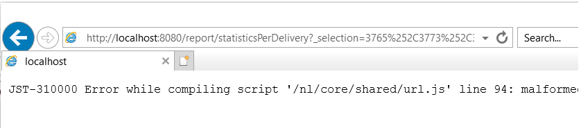
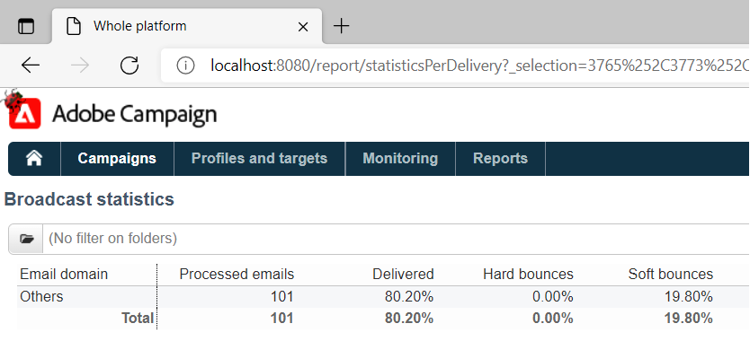

# Los informes de envío no pueden agregar estadísticas en ACC debido a la limitación de IE

## Descripción


El problema está relacionado con la longitud máxima de la URL en Internet Explorer, que es de 2048 caracteres: [detalles](https://support.microsoft.com/en-us/topic/maximum-url-length-is-2-083-characters-in-internet-explorer-174e7c8a-6666-f4e0-6fd6-908b53c12246).

La fuente de HTML de la página muestra informes dentro del cliente ACC.

Las direcciones URL dentro de la variable `href` atributos de la variable `a` las etiquetas son buenas, es decir, no están truncadas. Sin embargo, si una URL se copia y se pega dentro de IE, trunca el vínculo a 2048 caracteres y no podrá abrirlo:



Lo mismo sucede al hacer clic con el botón derecho en el informe dentro del cliente ACC y seleccionar *&quot;Abrir en ventana nueva.&quot;* Se abrirá IE automáticamente, pero la barra de direcciones estará vacía. Si se seleccionan menos entregas y se repiten los pasos, IE se abrirá con la dirección URL correcta.

Actualmente, hay un esfuerzo constante para reemplazar a IE por [!DNL Edge]. [!DNL Edge] se basa en [!DNL Chromium] y no tiene estas restricciones de dirección URL. Esto se ha confirmado copiando/pegando la dirección URL larga en [!DNL Edge] que no trunca la dirección URL y abre el informe sin problemas:




## Resolución


Este problema debe resolverse automáticamente una vez que se haya realizado la transición de IE a [!DNL Edge] ha finalizado. Hasta entonces, se puede implementar la siguiente solución:

- Copie la dirección URL al informe desde el cliente ACC haciendo clic con el botón derecho en el informe y seleccionando *el método abreviado Copiar*. Debe copiar toda la dirección URL en el portapapeles;
- La URL debe modificarse ligeramente para poder abrirla en otros navegadores. La URL copiada del cliente seguirá este patrón:


```
javascript:switchToReportView(%22statisticsPerDelivery%22,%20%22/report/statisticsPerDelivery?_selection=3765%252C37...
```


- Parte de la dirección URL que comienza por `/report/` debe copiarse y añadirse a la dirección de la instancia. Por ejemplo, (en mi caso, la dirección es localhost):


```
http://localhost:8080/report/statisticsPerDelivery?_selection=3765%252C3773%252C3781%252C3789%252C3793%252C3769%...
```


- Copie la URL resultante en otro navegador: [!DNL Edge], [!DNL Firefox] o [!DNL Chrome] deberían funcionar bien.
