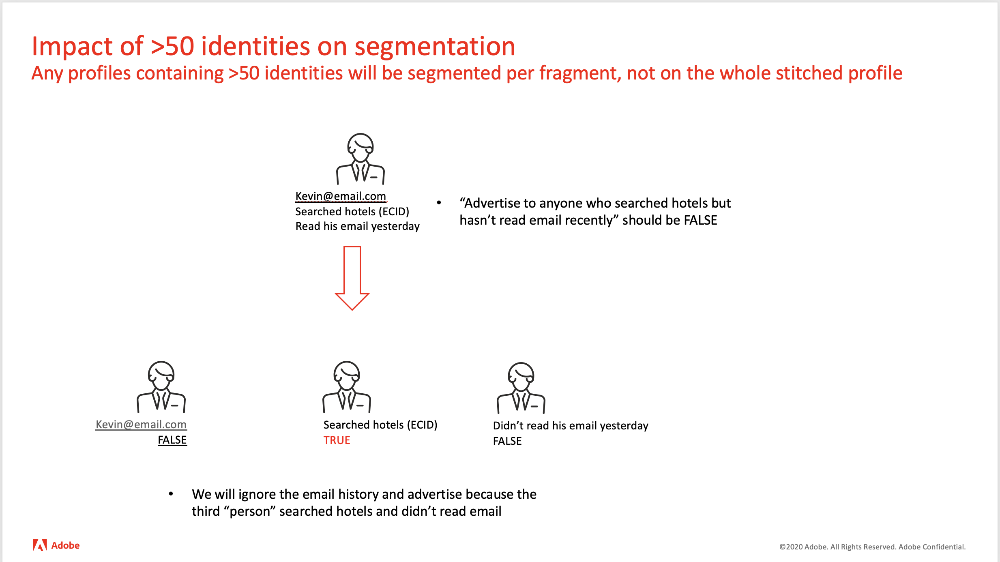

# Clasificación de perfiles en segmentos con más de 50 identidades

## Descripción


Pregunta: ¿Pueden los perfiles con más de 50 identidades cumplir los requisitos para los segmentos?

Entorno: Adobe Experience Platform





## Resolución


Cuando los segmentos se definen para utilizar Private Graph, el proceso normal es que los fragmentos de perfil se consulten utilizando todos los ID del gráfico de identidad y los resultados se agrupan en un único perfil que combina registros de perfil y registros de eventos. Sin embargo, cuando un gráfico de identidad tiene más de 50 entidades, los fragmentos de perfil no se ensamblan en un perfil. En su lugar, cada fragmento de perfil se trata como un perfil completo y la evaluación del segmento se realiza individualmente con cada fragmento. Por ejemplo, un segmento definido para incluir residentes de California se evaluará como verdadero para el fragmento de perfil que contiene el atributo de estado, pero el otro fragmento de perfil y evento se evaluará como falso. Del mismo modo, un segmento definido para incluir la exploración de páginas web se evaluará como verdadero para la variable [!DNL Analytics] fragmento de grupo de informes, pero los fragmentos de perfil y otros fragmentos de evento se evaluarán como falsos. El riesgo es cuando el segmento contiene una condición negativa, por ejemplo &quot;la semana pasada no se envió ningún correo electrónico&quot;. El evento de correo electrónico no se vincula a ningún perfil u otros registros de eventos, por lo que la evaluación del perfil y otros eventos pueden generar un falso positivo.


Para evitar que cualquier fragmento se evalúe como verdadero, un método es incluir una condición tanto en un atributo de perfil como en un evento, por ejemplo &quot;... donde existe customer_id y al menos existe un evento&quot;. Ningún fragmento tendrá ambos criterios, por lo que ningún fragmento se evaluará como verdadero. Normalmente, es posible añadir pruebas de existencia tanto en perfiles como en eventos sin alterar los resultados de segmentación, por ejemplo, probar un ID de CRM al segmentar clientes conocidos.

Para determinar si un gráfico de identidad tiene más de 50 entradas para un uso de identidad [!DNL Postman] para llamar al UPS a través de la API con el ID de identidad como se muestra a continuación.   La respuesta incluirá el error indicado si se ha superado el máximo de 50.

[!DNL Postman] Configuración de API


```
GET /data/core/ups/access/entities?entityId=KRN1136260447&entityIdNS=custid&schema.name=_xdm.context.profile HTTP/1.1
Host: platform.adobe.io
Content-Type: application/json
Authorization: Bearer 
x-gw-ims-org-id: <b></b><b></b>*
x-api-key: acp_onboarding
```

<br><br>Respuesta:<br><br>

```
{
    "message": "Received too many related identities. Received: 85, Maximum: 50.",
    "statusCode": 422,
    "type": "http://ns.adobe.com/aep/errors/UPSDK-112004-422",
    "title": "Too many related identities.",
    "error-code": "UPSDK-112004-422",
    "error-message": "Received too many related identities. Received: 85, Maximum: 50.",
    "status": 422
}
```
