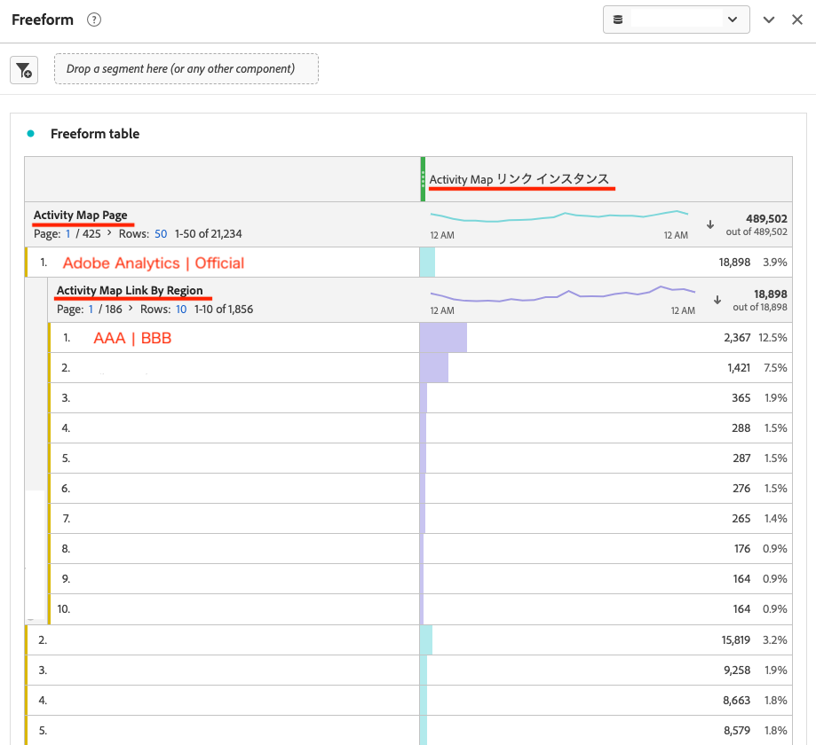

# Reproducción del &quot;informe de vínculos&quot; del Activity Map en la &quot;tabla improvisada&quot; en el espacio de trabajo de Adobe Analytics

## Descripción

Realmente me gusta y uso el Activity Map en la aplicación Adobe Analytics. Por lo tanto, uso mucho el &quot;Informe de vínculos&quot;, pero no puedo averiguar cómo reproducirlo en la &quot;Tabla improvisada&quot; en el espacio de trabajo de Adobe Analytics. ¿Qué tipo de &quot;Métricas&quot; y &quot;Dimension&quot; puedo usar para reproducir esto?

## Resolución

Este es un ejemplo de una muestra.

1. En primer lugar, abra un nuevo proyecto en el &quot;Espacio de trabajo&quot; de Adobe Analytics y coloque la &quot;Tabla de forma libre&quot; del carril izquierdo en el panel. 
2. A continuación, combine el &quot;Intervalo de fechas&quot; del panel con el período de tiempo sobre el que realiza informes en el Activity Map.
3. Para el &quot;Dimension&quot;, utilice &quot;Página de Activity Map&quot; y &quot;Vínculos y región de Activity Map&quot;. Coloque la &quot;Página de Activity Map&quot; en la tabla de forma libre y luego coloque la &quot;Región y vínculos de Activity Map&quot; en la página de la que desee informar. El elemento mostrado será una combinación de los elementos &quot;ID del vínculo&quot; y &quot;Región&quot; que se muestran en el Activity Map &quot;Informe del vínculo&quot;. (Ejemplo: ID del vínculo=AAA | Región=BBB)
4. Utilice &quot;Instancias de Activity Map&quot; para &quot;Métricas&quot;. Inserte esta &quot;Instancias de Activity Map&quot; en la zona de colocación Métrica de la parte superior.
5. Ahora puede reproducir los mismos valores en la &quot;Tabla improvisada&quot; que en el &quot;Informe de vínculos&quot;.

・Creación de informes de Activity Map en Analytics: dimensiones de Activity Map de Analytics
[https://experienceleague.adobe.com/docs/analytics/analyze/activity-map/activitymap-reporting-analytics.html](https://experienceleague.adobe.com/docs/analytics/analyze/activity-map/activitymap-reporting-analytics.html)

Nota: Sin embargo, al comparar el &quot;informe de vínculos&quot; del Activity Map con la &quot;tabla improvisada&quot;, puede que encuentre &quot;ID de vínculos&quot; en la &quot;tabla improvisada&quot; que no se muestran en el &quot;informe de vínculos&quot;. Esto se debe a que las especificaciones del &quot;Informe de vínculo&quot; y de la &quot;Tabla de forma libre&quot; del Activity Map son diferentes. En el &quot;Informe de vínculo&quot;, solo se incluirán en los informes los elementos de vínculo que existan en el momento en que se inicia el Activity Map y se carga la página. Por otro lado, en la &quot;Tabla improvisada&quot;, todos los vínculos que se hayan hecho clic en el pasado y que se hayan medido en el Activity Map se incluirán en el informe, incluso si el vínculo no existe actualmente en la página de destino. En este caso, debe utilizar la función &quot;Segmento&quot; o &quot;Filtro&quot; para eliminar elementos innecesarios en la &quot;Tabla improvisada&quot;.
