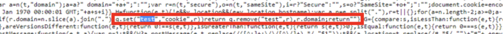

# Adobe Analytics: ¿Cuál es la cookie &quot;test&quot; en VisitorAPI.js?

## Descripción

Dentro de `VisitorAPI.js` una cookie con el nombre &quot;test&quot;. Pueden preguntarse para qué se utiliza esto. Simplemente se escribe en la página para verificar que las cookies se pueden escribir en la página y luego se pueden eliminar inmediatamente.

## Resolución

- Nombre de la cookie: Prueba
- Descripción: Cookie interna escrita para probar la compatibilidad con cookies del explorador.
- Duración: Caduca inmediatamente
- Dominio: Escrito en el dominio del sitio web
- Tamaño: 2 bytes por carácter JS (la cookie escribe una carta sin sentido)
