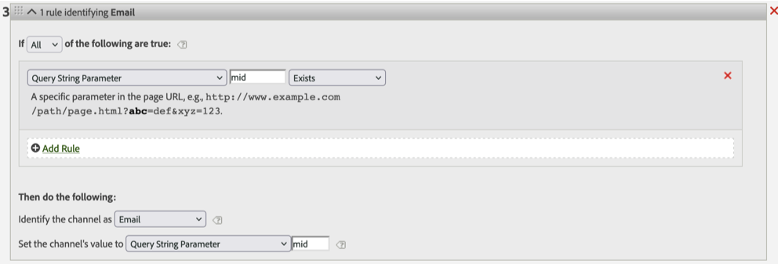

# Por qué la regla de procesamiento del canal de marketing relacionada con la dirección URL de la página omite la llamada de seguimiento de vínculos

## Descripción

 
 Problema:
 Supongamos que tiene una regla de procesamiento de canal de marketing como la que se muestra a continuación, debe encajar en el canal &quot;Correo electrónico&quot; si la dirección URL de una página tiene un parámetro de cadena de consulta &quot;mid&quot;.
 Sin embargo, en algunos casos, el canal &quot;Correo electrónico&quot; puede ignorar una dirección URL de página con el parámetro de consulta &quot;mid&quot; como por debajo de 1 y caer en otra.
  
 1 [http://www.example.com/home.html?mid=123](http://www.example.com/home.html?mid=123)
  
 Imagen1
 
  

## Resolución

Resolución:

Compruebe si el tipo de llamada al servidor es [seguimiento de vínculos](https://experienceleague.adobe.com/docs/analytics/implementation/vars/functions/tl-method.html?lang=en) como Vínculo personalizado en lugar de vista de página.  Si se trata de una llamada de seguimiento de vínculos, funciona como está diseñado.

Causa principal:

Los servidores de recopilación de datos de Adobe eliminan la dimensión pageURL de todos los [seguimiento de vínculos](https://experienceleague.adobe.com/docs/analytics/implementation/vars/functions/tl-method.html?lang=en) solicitudes de imagen. 1 Como tal, la regla de coincidencia de URL de página no funciona con las llamadas de seguimiento de vínculos.

1 [https://experienceleague.adobe.com/docs/analytics/implementation/vars/page-vars/pageurl.html?lang=en](https://experienceleague.adobe.com/docs/analytics/implementation/vars/page-vars/pageurl.html?lang=en)
