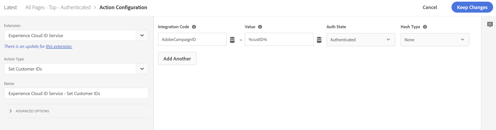
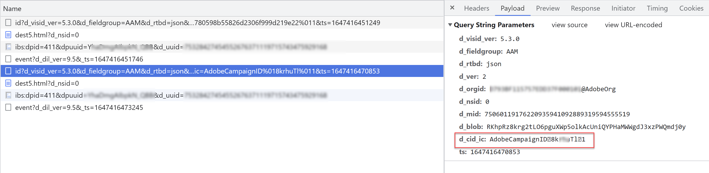

# Experience Cloud/[!UICONTROL Biblioteca de audiencias]/AAM audiencias y segmentos no tienen volumen ni tamaño en Adobe Campaign

## Descripción

PROBLEMA/SÍNTOMA:

Aunque todo parece estar configurado correctamente, Experience Cloud/[!UICONTROL Biblioteca de audiencias]/AAM audiencias y segmentos no tienen volumen ni tamaño en Adobe Campaign

CONFIGURACIÓN DEL ENTORNO:

- Campaign Classic o Campaign Standard
- AAM y/o [!UICONTROL Biblioteca de audiencias]
- Configurado correctamente [Campaign Standard](https://experienceleague.adobe.com/docs/campaign-standard/using/integrating-with-adobe-cloud/working-with-campaign-and-audience-manager-or-people-core-service/provisioning-and-configuring-integration-with-audience-manager-or-people-core-service.html?lang=en) o [Classic](https://experienceleague.adobe.com/docs/campaign-classic/using/integrating-with-adobe-experience-cloud/audience-sharing/configuring-shared-audiences-integration-in-adobe-campaign.html?lang=en) para utilizar Audiencias de Experience Cloud (servicio principal People, [!UICONTROL Biblioteca de audiencias], o AAM)
- Si es Campaign Classic: Los usuarios pueden iniciar sesión en el Campaign Classic a través del IMS de Adobe
- AAM segmento o [!UICONTROL Biblioteca de audiencias] La audiencia se ha configurado para enviarse a [!DNL Campaign] usando la variable [!UICONTROL ID declarado] fuente de datos dentro de la variable [!DNL Campaign] IU.

## Resolución

CAUSAS RAÍZ:

Porque uno de [!DNL Campaign]El principal propósito de es enviar mensajes (correo electrónico, SMS, etc.) a personas conocidas, AAM ([!UICONTROL Biblioteca de audiencias]) debe tener el mismo ID que [!DNL Campaign] usos para la identificación de clientes almacenados en su propio (AAM) [!UICONTROL ID declarado] fuente de datos. Para esta integración, AAM ([!UICONTROL Biblioteca de audiencias]) simplemente envía la lista de ID de cliente para los clientes del segmento o audiencia elegido a [!DNL Campaign] para que [!DNL Campaign] puede identificar y crear una lista de las mismas personas. Si AAM no tiene los ID para enviar, no se enviará ninguna audiencia desde AAM ([!UICONTROL Biblioteca de audiencias]) a [!DNL Campaign].

PASOS PARA RESOLVER:

Siga los siguientes pasos para almacenar el ID de cliente necesario en AAM [!UICONTROL ID declarado] fuente de datos:

1. Asegúrese de que se pueda mostrar el ID de cliente necesario a la página cuando el usuario final se autentique.
1. Cuando el usuario final se autentique, sincronice el identificador del cliente con AAM [!UICONTROL ID declarado] fuente de datos a través de la variable [Función setCustomerID del servicio de ID de Experience Cloud](https://experienceleague.adobe.com/docs/id-service/using/id-service-api/methods/setcustomerids.html?lang=en) (o utilice el servicio de ID de Experience Cloud: establezca la acción del ID de cliente en [!UICONTROL Recopilación de datos]) utilizando el código/alias de integración: `AdobeCampaignID`. Por ejemplo:

   ```
   Visitor.setCustomerIDs({
        "AdobeCampaignID":{ 
            "id":"YOUR CUSTOMER ID", 
            "authState":Visitor.AuthState.AUTHENTICATED 
        } 
   });
   ```

   o [!UICONTROL Recopilación de datos]:

   

   Donde `%custID%` representa un elemento de datos en el que se almacena el ID de cliente necesario

1. Validar que el ID se envíe a AAM buscando la variable `d_cid_ic` del parámetro `demdex.net` llamada de red enviada cuando la variable `setCustomerID` llamada a . Debería ver el `AdobeCampaignID` código de integración, el ID de cliente y el valor de 1 (que significa autenticado) separado por un carácter no imprimible.

   

1. Espere unos días para que se recopilen los ID de cliente en AAM y supervise el tamaño de la audiencia en [!DNL Campaign].
