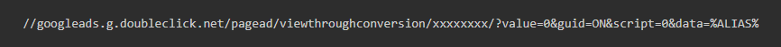
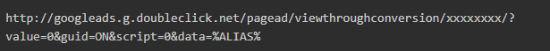
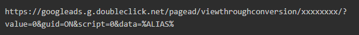
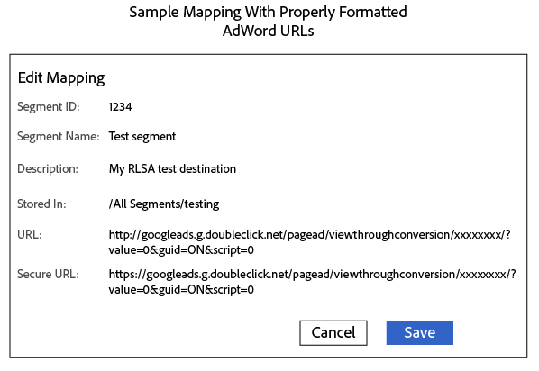

# Destino de Google: AAM

## Descripción

 Este artículo pretende responder a las siguientes preguntas.      Preguntas :   
1. ¿Cuántos tipos de integración tenemos para google?
2. ¿Cómo configurar S2S Destination ?
3. ¿Cómo se RLSA?
4. Puntos que recordar

## Resolución

\* Tipos de destinos
- Destino de S2S
- Destino de URL

  \*Destino de URL: Lista de remarketing de Google Ads  
A continuación se indican algunos pasos que deben seguirse para configurar el destino de la URL.

1. En su cuenta de Google Ads, [crear una lista de remarketing de sitio web](https://support.google.com/adwords/answer/2454064?hl=en) y anote su ID de conversión.
2. Utilice la siguiente URL como plantilla para la URL base y la URL segura. <b>Reemplace la sección &quot;xxxxxxx&quot; (xxxxxxxx) por su ID de conversión.</b>
3. En AAM, cree un destino de URL. Siga este vínculo ([Crear un destino de URL](https://experienceleague.adobe.com/docs/audience-manager/user-guide/features/destinations/custom-destinations/create-url-destination.html?lang=en)).
4. En la sección Asignaciones de segmentos del destino URL, añada el código del paso 2 a los campos URL y URL segura . Agregue a http: and https: in los campos URL y Secure URL respectivamente.

Tenga en cuenta que hay dos tipos de URL

Dirección URL base o código de URL no seguro -<b> Comienza con HTTP</b>

Código de URL seguro - <b>Iniciar con HTTPS</b>

5. Haga clic en Guardar.

6. Al asignar un nuevo segmento a este destino en Audience Manager, defina la asignación como `aam=segmentID` y reemplace `segmentID` con el ID de su segmento.

7. Al definir un bloque en Google Ads, cree una regla que coincida con la asignación definida en el paso 6.

\*S2S Destino:
1. Para comenzar con la creación de destinos S2S para Google, CC o Consultant se transferirán con el tipo de cuenta. El tipo de cuenta puede ser de los siguientes tipos: INVITE_ADVERTISER , INVITE_PARTNER, DFP, ADX, ADX_PUBLISHER , DFP_BY_GOOGLE, DFP_BY_GOOGLE. Además, tenga en cuenta que este tipo debe incluirse en la lista de admitidos en Google. (El cliente puede consultar con el equipo de Google para esta parte).
2. Una vez que tengamos este detalle, CC o Consultant pueden crear el destino.

     \*Puntos que recordar:   
\* La configuración de destino de Google S2S admitirá la transferencia de datos para TODOS los 6 tipos de dispositivo siguientes:  <b>web-cookie / iOS-mobile / android-mobile/ Roku / Microsoft / Amazon Fire TV</b>.

\* Para crear una URL para la lista de remarketing de Google Ads, asegúrese de usar <b>&quot;%ALIAS%&quot;</b> en ambos tipos de direcciones URL. Como esta es una macro que se reemplazará en tiempo de ejecución.

\* Si se produce algún error al crear S2S Destination para google, compruebe los puntos siguientes.

1. La cuenta debe incluirse en la lista blanca de Google.

2. Está utilizando detalles correctos como (protocolo, servidores, formato, fuente de datos de Target, etc.). Consulte el enlace del segmento S2S.
