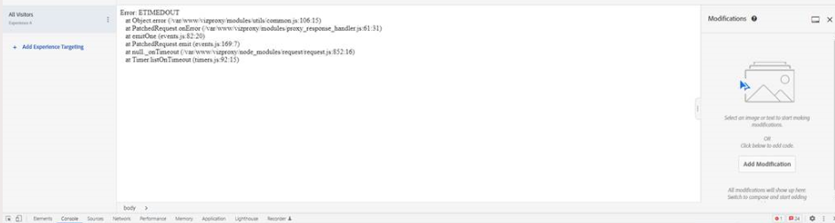
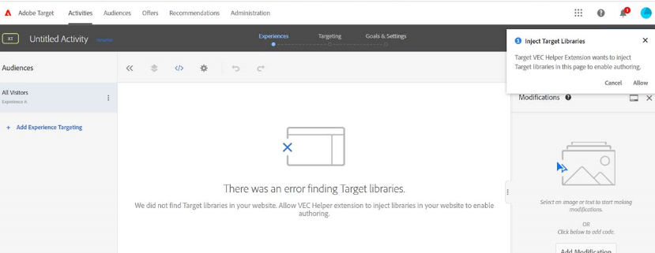
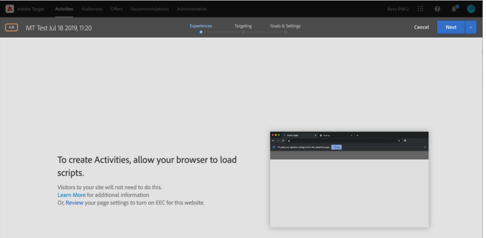
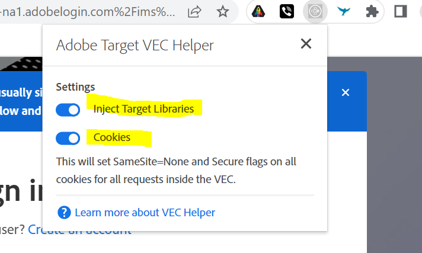
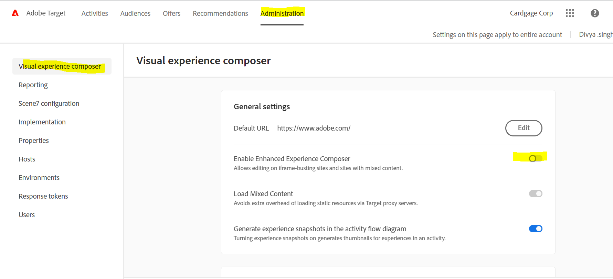

# Solución de problemas/depuración del VEC de Target

## Descripción

No se puede cargar la dirección URL de la página en el VEC de Adobe Target.

Estos son algunos errores de muestra:

- 
- 
- 

## Resolución

1. Intente borrar cookies y cachés o abra su sitio web en modo incógnito. 

1. Intente utilizar un navegador alternativo, como - [!DNL Mozilla Firefox], [!DNL Microsoft Edge]

1. En estos casos de error, instale la extensión del explorador VEC helper

   1. Instale la extensión desde [https://chrome.google.com/webstore/detail/adobe-target-vec-helper/ggjpideecfnbipkacplkhhaflkdjagak](https://chrome.google.com/webstore/detail/adobe-target-vec-helper/ggjpideecfnbipkacplkhhaflkdjagak)

   1. Para utilizar la extensión, haga clic en el icono de la extensión del explorador VEC Helper en la [!DNL Chrome] barra de herramientas del explorador mientras está en el VEC. 

   1. Active el &quot;**insertar bibliotecas de target**&quot; y &quot;cookies&quot; activan.

      

   1. Ventana emergente que le pide que permita que la extensión agregue bibliotecas de destino a la página para habilitar la creación, lo que debe permitir.

   1. Permitir el contenido no seguro de la configuración del sitio ([https://experienceleague.adobe.com/docs/target/using/experiences/vec/troubleshoot-composer/mixed-content.html?lang=en](https://experienceleague.adobe.com/docs/target/using/experiences/vec/troubleshoot-composer/mixed-content.html?lang=en))

      - Haga clic en el icono de bloqueo (precaución) y, a continuación, haga clic en la configuración del sitio.

      - Desplácese hasta el contenido no seguro y, a continuación, utilice la lista desplegable para cambiar &quot;Bloque (predeterminado)&quot; por &quot;Permitir&quot;.

      - Vuelva a cargar la página del VEC.
   1. Establezca EEC (Compositor de experiencias mejorado) como desactivado mediante los siguientes pasos

      - Vaya a [!DNL Target] - [!UICONTROL Administración] - VEC - Desactivar el EEC

         
   Nota: En caso de que el problema persista, abra la consola del desarrollador del navegador y busque allí un mensaje de error.

1. El destino no es compatible si el sitio web contiene iframes de varios niveles. 

**Acceso a páginas posteriores al inicio de sesión en VEC**

1. Cargue la página en VEC y haga clic en la &quot;pestaña del explorador&quot;, introduzca sus credenciales y vaya a la página que desee. 
1. Haga clic en [!UICONTROL Componer] y realice la modificación dentro del VEC. 

OR

1. Abra un sitio web en una pestaña nueva e introduzca sus credenciales de inicio de sesión.
1. Abrir VEC en [!DNL Target] y cargar directamente la página después de iniciar sesión. 
1. Ahora, la página se cargará en VEC para realizar la modificación.
