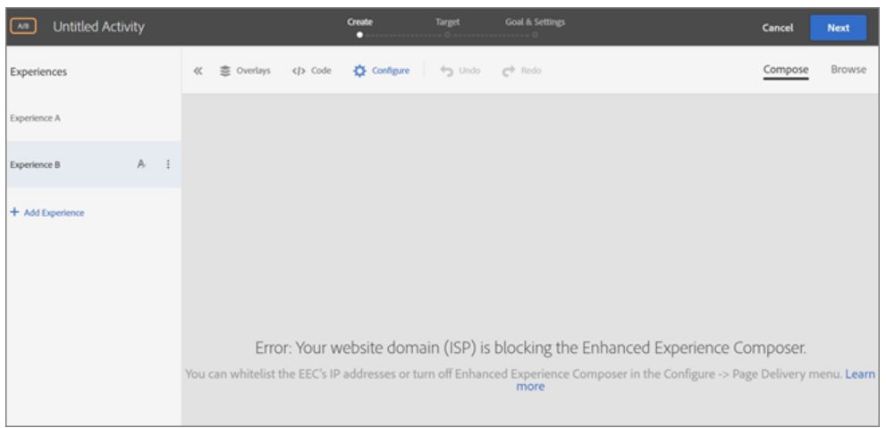

# Solución de problemas EEC de Adobe Target

## Descripción

<b>Problemas comunes relacionados con la CEE</b>     1. El EEC no carga una URL de control de calidad interna que no es accesible desde una IP pública.  2. Veo errores de tiempo de espera o “acceso denegado” al cargar sitios con el proxy habilitado. (Solo EEC)  3. Dominio de sitio web que bloquea el EEC  

## Resolución

<b>Problema: </b>El dominio del sitio web (ISP) está bloqueando el Compositor de experiencias mejorado.

<b>Solución:</b> Lista de permitidos de las direcciones IP enumeradas a continuación (Pida a su equipo de TI que lista de permitidos las siguientes direcciones IP)

- 34 253 100 20
- 34 248 100 23
- 52 49 228 246
- 54.205.42.123
- 107.22.177.39
- 52.201.5.105
- 52.193.211.177
- 18 180 24 249
- 52.194.154.154

Además, puede desactivar el Compositor de experiencias mejorado en [!UICONTROL Configurar] - [!UICONTROL Entrega de páginas] para abrir el Navegador.

<b>Problema:</b> Veo errores de tiempo de espera o &quot;acceso denegado&quot; al cargar sitios con el proxy habilitado. (Solo EEC)  

<b>Solución: </b>Asegúrese de que las IP del proxy no estén bloqueadas en su entorno.
     

<b>Problema: </b>El EEC no se carga en páginas seguras de mi sitio que utilizan TLS 1.0. (Solo EEC)  

<b>Solución: </b>Podría ver el mensaje de error descrito anteriormente en &quot;El Compositor de experiencias visuales mejorado no se carga en las páginas seguras de mi sitio&quot;. si las direcciones IP anteriores están incluidas en la lista de permitidos, pero su sitio web no admite TLS versión 1.2.

[!DNL Target] actualmente utiliza la configuración predeterminada de 1.2. Antes de [!DNL Target] 18.4.1 (25 de abril de 2018), la configuración predeterminada era compatible con TLS 1.0.

  Cómo comprobar la versión de TLS que utiliza el explorador  1. Abra el sitio web afectado en [!DNL Chrome].  2.<b> </b>En el [!DNL Chrome] (las tres elipses verticales), haga clic en Más herramientas: Herramientas para desarrolladores.

![[!DNL Chrome] Herramientas para desarrolladores](https://experienceleague.adobe.com/docs/target/assets/chrome-developer-tools.png?lang=en)

3. Abra la pestaña Seguridad y, a continuación, examine la información de la versión TLS en Conexión:

