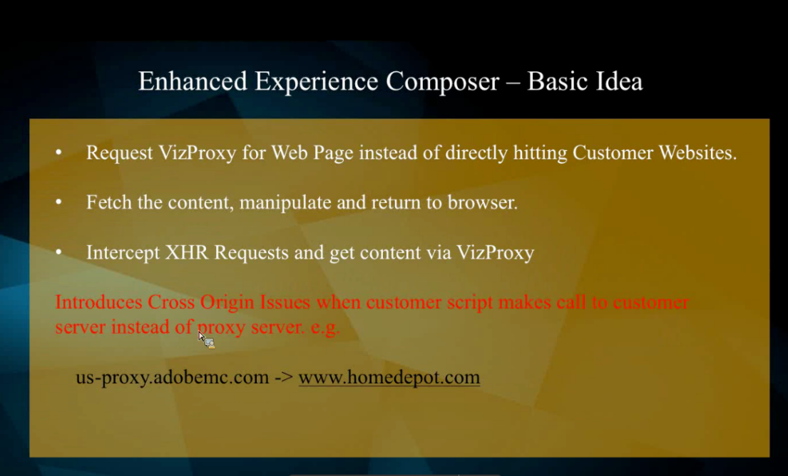

# Problemas EEC y pasos de resolución de problemas

## Descripción

<b>Este artículo pretende abordar algunos problemas/errores comunes a los que nos enfrentamos en nuestra [!DNL Target] EEC</b>     a. Obteniendo errores como: &quot;El dominio del sitio web está bloqueando el Compositor de experiencias mejorado&quot; o errores de &quot;acceso denegado&quot; al cargar sitios con el proxy habilitado o EEC no carga una URL de control de calidad interna a la que no se puede acceder desde una IP pública.     b. EEC no carga páginas seguras en mi sitio que usa TLS 1.0. (Solo EEC)         

## Resolución

<b>Funcionalidad EEC:</b>

<b>Pasos de solución de problemas de EEC:</b>

<b>1. Al obtener errores EEC como &quot;El dominio del sitio web está bloqueando el Compositor de experiencias mejorado&quot; o EEC no se carga una URL de control de calidad interna que no es accesible desde una IP pública.</b>

Solicite al cliente que incluya en la lista blanca los siguientes DNS/IP en caso de que vea Timeout u otros 400 mensajes en estas solicitudes en la Red o en la pestaña Consola de [!DNL Chrome] Herramientas para desarrolladores:

EE. UU.: vizproxy-prod-us-2024941706.us-east-1.elb.amazonaws.com.
54.173.241.58 3.234.111.144 EMEA: vizproxy-prod-emea-1118976074.eu-west-1.elb.amazonaws.com.
34.246.105.190 34.249.15.238 APAC: vizproxy-prod-apac-1398366183.ap-northeast-1.elb.amazonaws.com.
52 192 148 52 69 47 228

<b>2.  Problema de TLS</b>

<b>Siga los siguientes pasos para comprobar la versión TLS del sitio web:</b>

a. Haga clic con el botón derecho en la página afectada y abra el elemento Inspect (consola del desarrollador)

b. En la consola de desarrolladores, podemos ver 3 puntos en la esquina superior derecha (junto al icono de engranaje). Haga clic en ella y expanda la opción más herramientas.

c. Seleccione la opción de seguridad. En seguridad, podríamos ver nuestra versión TLS.

d. Póngase en contacto con el Servicio de atención al cliente para cambiar la versión TLS si la versión actual es 1.0
