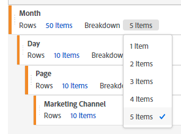

# Una limitación que indica el número de desgloses al generar informes en el Generador de tablas improvisadas.

## Descripción

Al crear un informe en el Generador de tablas, que es una de las características de Workspace en Adobe Analytics, el número de desgloses está limitado a cinco elementos, a diferencia de Filas. 

## Resolución

En este momento, el número máximo de desgloses es de cinco elementos. Por lo tanto, para mostrar el resultado Desglose de más de cinco elementos, es necesario crear un informe con el Generador de tablas una vez con cinco elementos y, a continuación, configurar Desglose manualmente para los elementos necesarios.

Por ejemplo, si establece &quot;Filas: 10 elementos&quot; y &quot;Desglose: 5 elementos&quot;, solo se desglosarán los 5 elementos principales de los resultados del informe mostrado. En ese caso, después de generar el informe, puede agregar manualmente el desglose de los cinco elementos inferiores para confirmar los resultados de los diez elementos que se desglosan. Si el informe también existe en la página siguiente, diez elementos, es decir, el número de resultados de desglose configurados manualmente, se mostrarán en la página siguiente, por lo que no es necesario configurarlos de nuevo en la página siguiente.
