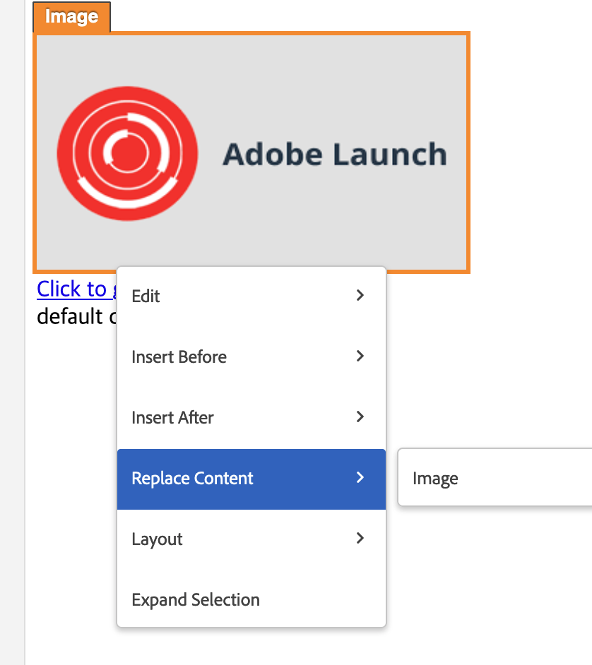

# Intercambiar imagen no funciona correctamente en el VEC de Target

## Descripción

<b>Problema:</b> En el VEC de Adobe Target, después de intercambiar una imagen en una página a través de la imagen de contenido de reemplazo del VEC de Adobe Target, la imagen no se carga correctamente, o a veces puede ver un icono de error en la ventana Modificaciones en la parte derecha de la ventana de edición del VEC.     

## Resolución

<b>Resolución: </b>Intente utilizar la acción del HTML de edición en el contenedor principal haciendo clic en el menú &quot;Expandir selección&quot; y reemplace el valor del atributo srcset en el código del HTML.

<b>Causa principal:</b> La acción de intercambiar imagen en VEC se basa en el atributo src de la etiqueta img y no funciona en el atributo srcset.
