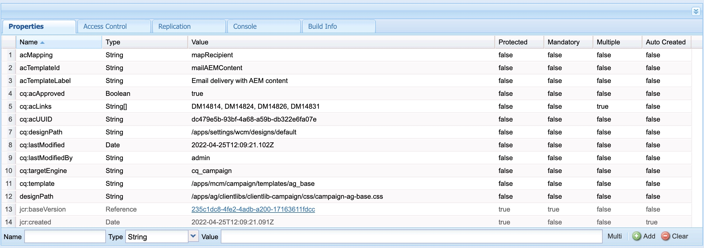
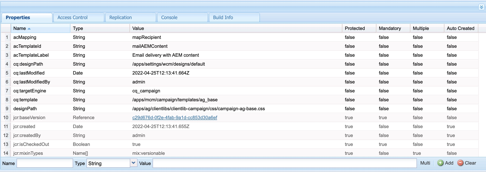
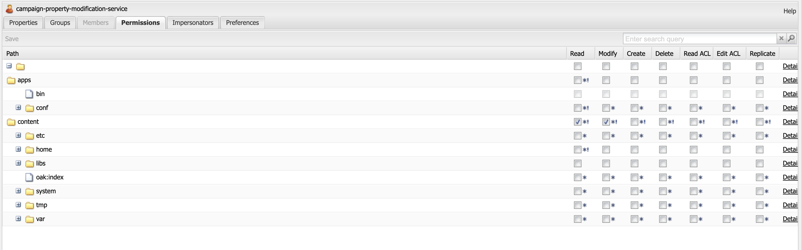

# AEM plantillas de correo electrónico no se sincronizan con Adobe Campaign.

## Descripción

Cuando un usuario intenta copiar y pegar la plantilla del sitio en la que la variable [!UICONTROL Aprobación de campaña] el flujo de trabajo ya se ha ejecutado, la variable `cq:acLinks` y `cq:acUUID` las propiedades de Adobe Campaign no se eliminan durante la operación de copiar y pegar.
    Debido a esto, Adobe Campaign no puede sincronizar la plantilla de correo electrónico desde AEM y produce un error: Se ha encontrado un acUUID duplicado como `cq:acLinks` y `cq:acUUID` las propiedades son propiedades únicas.
    <b>Pasos a seguir:</b>
 1: Cree una plantilla de correo electrónico del sitio en AEM.
 2: [!UICONTROL Aprobación de campaña] flujo de trabajo.
 3: Apruebe la plantilla completando los pasos del flujo de trabajo.
 4: Vaya a crx/de.
 5: La plantilla copiada/pegada contiene `cq:acLinks` y `cq:acUUID` propiedades.

<b>Errores en los registros:</b>
 No se pueden encontrar errores relacionados en los registros de errores.     <b>Propiedades de la plantilla en la operación crx/de tras copiar y pegar:</b>     <b>Comportamiento de la experiencia :</b>          <b>Comportamiento esperado:</b>
    

## Resolución

La variable `campaign-property-modification-service` es un usuario de servicio que se utiliza para modificar las propiedades del boletín de campaña en la función de copiar y pegar.
Esta `usercampaign-property-modification-service` debe tener permisos de lectura y modificación en la carpeta de contenido.

Si no tiene permisos de lectura y modificación en la carpeta de contenido, no puede limpiar la `cq:acLinks` y `cq:acUUID` propiedades de la plantilla de sitio copiada y pegada.

Después de proporcionar al usuario los permisos necesarios, las propiedades se limpian.

<b>Captura de pantalla de Permisos de usuario:</b>

