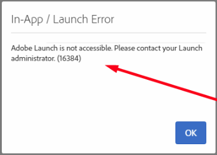

# [!DNL Launch] La sincronización no funciona

## Descripción

Puede experimentar el siguiente error:     

## Resolución

Este problema siempre se resolverá cuando cierre la sesión y vuelva a iniciarla, ya que [!DNL Launch] espera algunos parámetros que pueden no estar presentes en algún momento debido a problemas específicos del explorador
