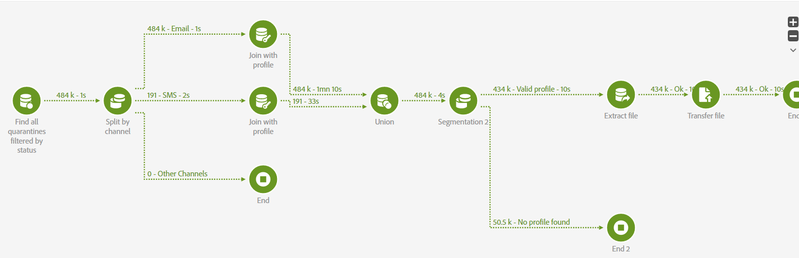

# ¿Cómo se puede exportar? [!UICONTROL Cuarentenas] por país

## Descripción

¿Cómo se puede exportar? [!UICONTROL Cuarentenas] por país?

## Resolución

- [!UICONTROL Cuarentenas] están en la tabla  `NmsAddressStatus`
   - Están vinculados a la última entrega, pero no a ningún perfil
   - Contienen la dirección de destinatario &quot;normalizada&quot; (por ejemplo, en minúsculas para correo electrónico / + prefijo para teléfono móvil)
- Hay 2 opciones para vincularlas a perfiles
   - Unirse al perfil a través del campo de dirección de la variable `AddressStatus` y Email/mobilePhone en el perfil
      - No devolverá los registros en los que la dirección no esté normalizada en el nivel de perfil
   - Unirse al perfil buscando todos los &quot;logs&quot; de envío (también contienen una dirección de destinatario normalizada) y luego unirse al perfil
      - Devolvería solo datos de los últimos 6 meses y nada para devoluciones duras más antiguas
      - Devolvería perfiles donde la dirección del destinatario ya se ha cambiado o corregido

