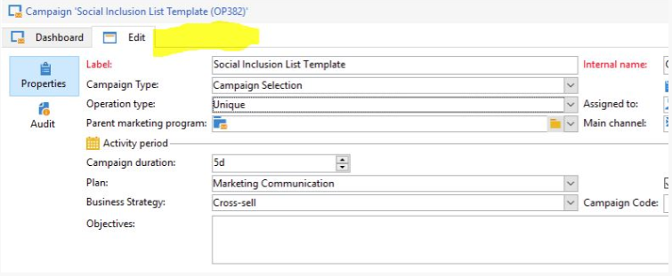
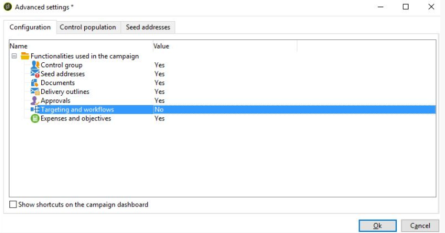

# No se puede ver la pestaña Segmentación y Flujo de trabajo en Campaign | Campaign Classic

## Descripción

La pestaña &quot;Segmentación y flujo de trabajo&quot; no está visible en la campaña.        Ejemplo :      

## Resolución

Este problema se debe a que la opción de las propiedades de la plantilla de campaña &quot;Funcionalidades utilizadas en la campaña&quot; no está activada.

- Compruebe la plantilla de campaña asociada a la campaña.
- Abra la plantilla de campaña.
- Vaya a Editar configuraciones de parámetros de campaña avanzados .

En esta pantalla, verá &quot;Segmentación y flujos de trabajo&quot; y seleccione el valor como Sí.

