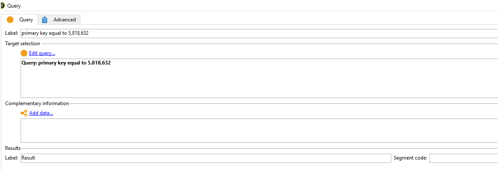
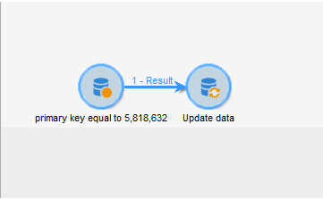
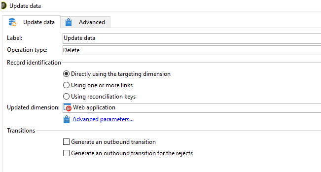

# No se puede eliminar WebApp - ERROR: el valor de clave duplicado infringe la restricción única &quot;xtkdictionarystring_name&quot;

## Descripción


En ocasiones, es posible que no pueda eliminar una aplicación web y que aparezca el siguiente error:

```
PGS-220000 PostgreSQL error: ERROR: duplicate key value violates unique constraint "xtkdictionarystring_name."

DETAIL: Key (iobjectid, ssourceid, slocale) = (0, del_5818632_closedFormLog, en) already exists.
```

## Resolución


Si encuentra este error en ACC al eliminar la aplicación web que ya no es necesaria, la resolución sería eliminar la aplicación web a través de [!UICONTROL Flujo de trabajo] (Como se muestra a continuación)

- Cree un nuevo flujo de trabajo y suelte una consulta y una actividad de actualización en el lienzo.

- Consulte la clave principal del webapp y actualice el tipo de operación como [!UICONTROL Eliminar] en [!UICONTROL Actualización de datos] actividad. Tenga en cuenta que una vez que la aplicación se elimina, no se puede recuperar a menos que se haya restaurado la base de datos.







