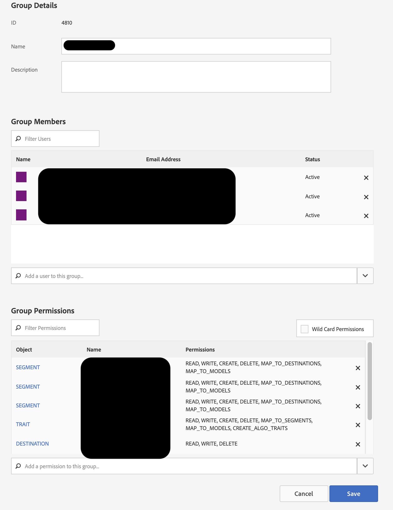
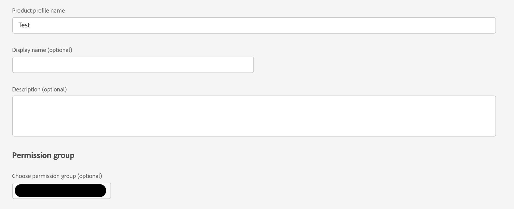
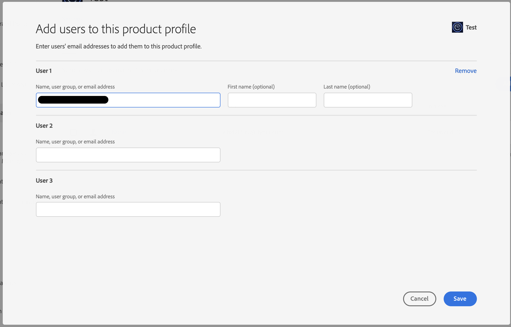

# No veo AAM opción de vincular el grupo de AD a AAM Grupo

## Descripción

¿Está intentando sincronizar un perfil de producto de Admin Console con un grupo de permisos de RBAC de Audience Manager? Este artículo puede ayudar.

## Resolución

Necesitará acceso de administrador al Audience Manager, así como acceso de administrador de productos en el Admin Console.

1) Cree un grupo de permisos RBAC en Audience Manager. Tome nota del nombre del grupo de permisos que elija:

2) Vaya al producto Audience Manager en Admin Console y cree un nuevo perfil de producto. Para ello, seleccione el grupo de permisos que acaba de crear en el menú desplegable:

3) Agregue usuarios relevantes al perfil de producto que acaba de crear:

