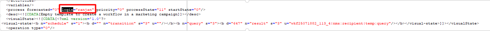

# No se puede iniciar el flujo de trabajo

## Descripción


<b>Problema</b>: Compruebe por qué no se puede ejecutar el flujo de trabajo siguiente, incluso después de cambiar el campo creado por en las propiedades del flujo de trabajo. Nombre interno del flujo de trabajo:  `prdWKFXXXX`
Si intentamos ejecutar el flujo de trabajo mencionado anteriormente, la variable [!DNL Campaign] jobs(`operationMgt`) el flujo de trabajo de monitorización generará un error de inicio de sesión no válido.

<b>Error del flujo de trabajo</b>:([!DNL Campaign] jobs(operationMgt)) BAS-010003 No se puede completar la operación en estado actual.
WKF-560044 Error al enviar la notificación con la plantilla de envío &quot;notificar al supervisor&quot;. Consulte el ID de registro de entrega 00000 para obtener más información (objeto asociado con la tarea de flujo de trabajo).
DLV-490118 Error durante la preparación. Para obtener más información, consulte el diario de acción de entrega &quot;27626534&quot;.
SCR-160012 JavaScript: error al evaluar el script &#39;operationMgt/scheduler&#39;.
XSV-350012 Inicio de sesión o contraseña no válidos. Conexión denegada.

Inicio del flujo de trabajo de la segmentación `prdWKF0000` para la campaña &quot;Nombre de campaña (nombre interno del flujo de trabajo)&quot;


<b>Análisis: </b>
Al iniciar este flujo de trabajo: prdWKF00000, el flujo de trabajo [!DNL Campaign] jobs(`operationMgt`) comenzó a fallar.
Empecé a buscar más información sobre lo que podría haber causado este problema y luego revisé el flujo de trabajo XML y encontré al culpable.

```
process forecasted="0" login="xxxxx@xxxx.com" priority="0"
           processState="20" startState="0"/
```

El operador mencionado anteriormente se ha deshabilitado, lo que ha provocado que se produzca un error en la variable [!DNL Campaign] flujo de trabajo de trabajos.


## Resolución


<b>Solución</b>:  Se reemplazó el inicio de sesión por un operador activo. Además, se guardaron los cambios en el flujo de trabajo y se volvió a ejecutar el flujo de trabajo. ¡Esto solucionó el problema!

```
process forecasted="0" login="ranjan" priority="0"
processState="20" startState="0"/
```



