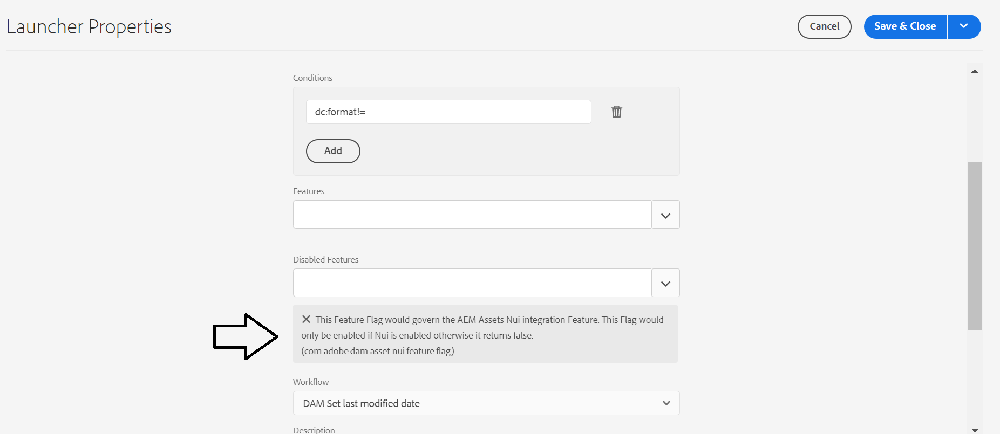

# Iniciador para &quot;[!UICONTROL Fecha de última modificación del conjunto DAM]&quot; el iniciador de flujo de trabajo no funciona después de la última actualización de AEMaaCS

## Descripción

Después de la última AEM como actualización del SDK de la nube ( 2022.4.7138.20220427T075748Z ), no se activa un iniciador personalizado para el inicio del flujo de trabajo &quot;Fecha de la última modificación del conjunto DAM&quot;.

Hace meses, el cliente creó un iniciador de flujo de trabajo para actualizar la última fecha modificada a los recursos en una carpeta concreta cuando el usuario cambia cualquier metadato.
Su lanzador es una copia del estándar pero, por supuesto, fue creado bajo `/conf` carpeta y no `/libs`.

Después de la última actualización del SDK, el lanzador ya no se está ejecutando.

## Resolución

El cliente proporcionó un paquete con el lanzador creado por ellos que ejecuta el &quot;[!UICONTROL Fecha de última modificación del conjunto DAM]&quot; en una carpeta de recursos personalizada.

El problema se podía reproducir en un entorno de prueba de AEMaaCS siguiendo los pasos siguientes:

1. Instale el paquete proporcionado por el cliente

2. Cree la misma estructura de carpetas que la utilizada por el cliente en AEM - [!UICONTROL Recursos]

3. Agregar recursos a la carpeta creada anteriormente

4. Modifique los metadatos (p. ej., el título) de un recurso en la carpeta especificada

Comportamiento esperado: el `jcr:LastModified` - La fecha debe actualizarse

Comportamiento experimentado: el `jcr:LastModified` - La fecha no cambia

<u>Resolución</u>

En AEM as a Cloud Service, la variable[!UICONTROL Fecha de última modificación del conjunto DAM]&quot; El iniciador tiene habilitado el siguiente indicador: &quot;[!UICONTROL Este indicador de características regiría la función de integración de AEM Assets Nui. Este indicador solo se habilitaría si Nui está habilitado; de lo contrario, devuelve false.] (`com.adobe.dam.asset.nui.feature.flag`)&quot;.

Después de quitar el indicador, el lanzador funciona según lo esperado.
