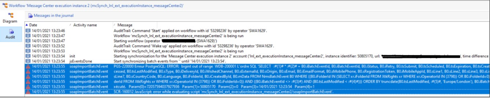
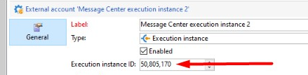

# Campaign Classic: PGS-220000 PostgreSQL: ERROR: bigint fuera de rango

## Descripción

Se ha informado del siguiente error al ejecutar el flujo de trabajo de archivado (mcSynch) desde el Centro de mensajes:

## Resolución

El problema es el ID de instancia de ejecución que se ha utilizado para identificar la instancia de ejecución de RT.

Como se muestra arriba, el valor utilizado es 50.805.170. El flujo de trabajo de archivado utiliza la ID de instancia de ejecución de la siguiente manera:

vars.CELL_OFFSET + &quot;\*&quot; + vars.cellId + &quot; + @id&quot;

Donde

- CELL_OFFSET es una constante (72057594037927936) creada por la actividad &quot;Información de conexión&quot;.

- cellId es la ID de instancia de ejecución

Estos dos números anteriores se multiplican juntos. El número de resultado final es mayor que el valor máximo del tipo de producto principal Postgres (https://www.postgresql.org/docs/10/datatype-numeric.html)

Los dos valores se añaden a la consulta de la siguiente manera:

SELECT   <b>:#(1)# \* :#(2)# + B0.iBatchEventId</b>, B0.iBatchEventId, B0.iStatus, B0.iRetry, B0.tsSubmit, B0.tsScheduled, B0.tsExpiration, B0.tsCreated, B0.tsProcessing, B0.tsLastModified, B0.sType, B0.BiDeliveryId,0.iWishedChannel, B0.sExternalId, B0.sOrigin, B0.sEmail, B0.iEmailFormat, B0.sMobilePhone, B0.sRegistrationToken, B0.iMobileAppId, B0.sLine1, B0.sLine2, B0.sLine3, B0.ss.sLine3 Line4, B0.sLine5, B0.sLine6, B0.sLine7, B0.sCountryCode, B0.sLanguage, B0.iFolderId, B0.iCreatedById, B0.mData FROM NmsBatchEvent B0 WHERE ((B0.iFolderId IN) (SELECT xr.iFolderId DESDE XtkRights xr WHERE xr.iOperatorId IN (3798) O B0.iFolderId=0) Y ((B0.iFolderId IN (SELECT xr.iFolderId FROM XtkRights xr WHERE xr.iOperatorId IN (3798)) O B0.ii FolderId=0)) AND ((B0.iBatchEventId :#(3)#) AND (B0.tsLastModified :#(4)#)) ORDEN POR truncdate(B0.tsLastModified, :#(5)#, &#39;Europe/London&#39;), B0.iBatchEventId LIMIT 501&#39; Parámetro(0))=72057594037927936\n — :#(1)#

Param(1)=50805170\n — :#(2)#

Param(2)=0\n Param(3)=09/04/2021 05:00:26\n Parámetro(4)=1

La solución es utilizar un número menor como ID de instancia de ejecución.
