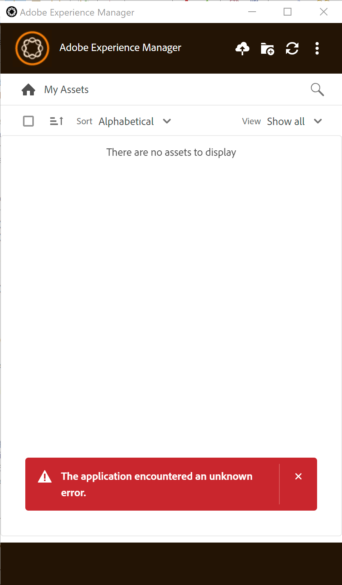

# AEM Aplicación de escritorio: la aplicación ha encontrado un error desconocido

## Descripción

Después de instalar y configurar la aplicación de escritorio de AEM siguiendo los pasos descritos en 1, al conectarse a la instancia de autor de AEM, la aplicación genera el error &quot;*La aplicación encontró un error desconocido* r&quot;.  
     1 [https://experienceleague.adobe.com/docs/experience-manager-desktop-app/using/install-upgrade.html?lang=en#install-v2](https://experienceleague.adobe.com/docs/experience-manager-desktop-app/using/install-upgrade.html?lang=en#install-v2)

## Resolución

El problema se puede reproducir cuando en el paso 8 en 1, la URL `http://aem_server:port/assets.html/content/dam` se utiliza para la conexión con el repositorio de Experience Manager en lugar de `http://aem_server:port`.

1 [https://experienceleague.adobe.com/docs/experience-manager-desktop-app/using/install-upgrade.html?lang=en#install-v2](https://experienceleague.adobe.com/docs/experience-manager-desktop-app/using/install-upgrade.html?lang=en#install-v2)
