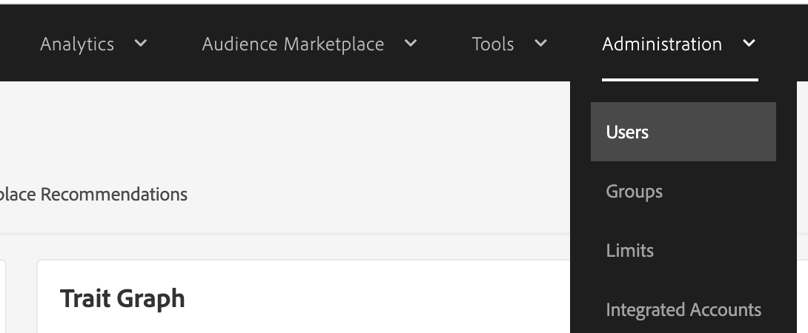
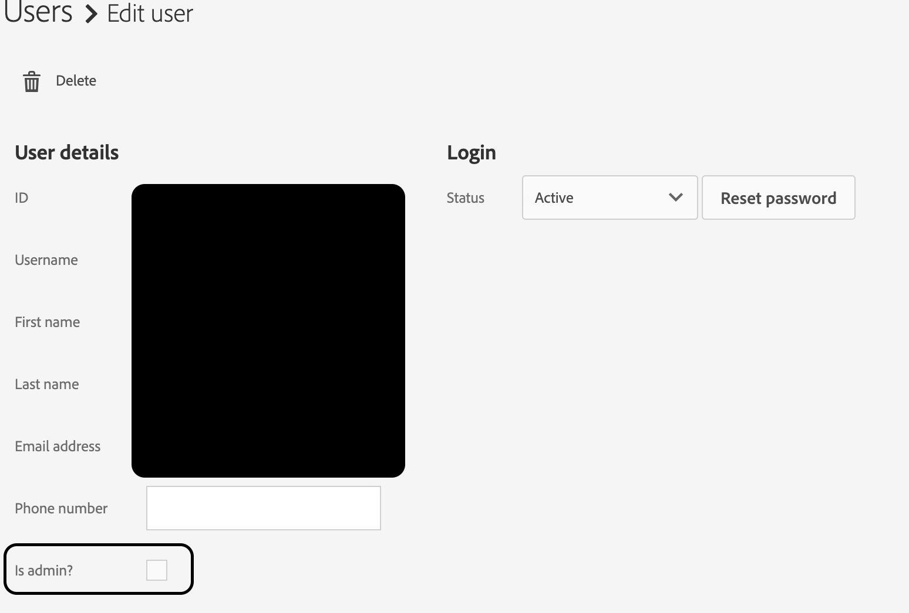

# Problemas de acceso en Adobe Audience Manager

## Descripción

¿Tiene problemas de acceso en Audience Manager, a pesar de que se le ha concedido acceso a través del Admin Console? Estos pasos ayudarán.

## Resolución

El administrador del sistema de AAM, dentro de la interfaz de usuario del Audience Manager (no el Admin Console), puede completar estos pasos para conceder permisos de administrador completos y escalados dentro de la interfaz de usuario del Audience Manager. Los controles RBAC también se pueden utilizar para otorgar permisos más granulares. Más información sobre RBAC disponible aquí: [https://experienceleague.adobe.com/docs/audience-manager/user-guide/features/administration/administration-overview.html?lang=en](https://experienceleague.adobe.com/docs/audience-manager/user-guide/features/administration/administration-overview.html?lang=es)

<b>Pasos para conceder permisos de administrador AAM sistema</b>

1) Navegar a Usuarios de administración

2) Busque la cuenta de usuario en cuestión y active la casilla &quot;Es administrador&quot; para conceder permisos de AAM completos.

