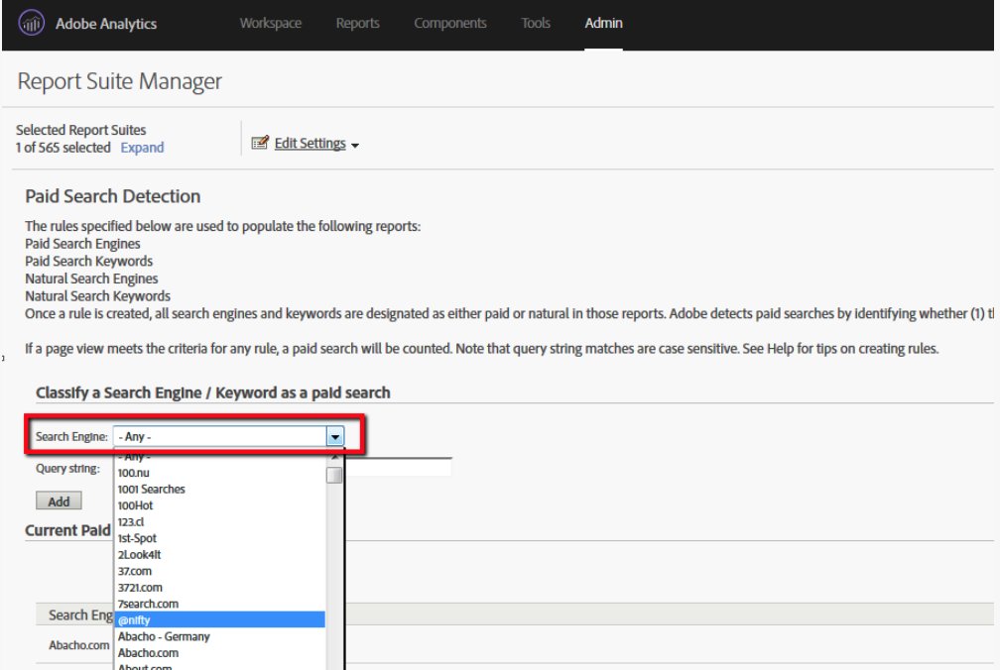

# ¿Cómo puedo obtener la lista de motores de búsqueda reconocidos por Adobe Analytics?

## Descripción

¿Puedo tener la lista de motores de búsqueda reconocidos por Adobe Analytics?
  

## Resolución

<b>Opción1</b>

Puede buscar rápidamente los motores de búsqueda registrados en Adobe Analytics en el menú Detección de búsqueda paga .

1. Iniciar sesión en Adobe Analytics
2. Administración&quot; Grupos de informes&quot; Editar configuración&quot; Detección de búsqueda de pago
3. Buscar motor de búsqueda en la barra de desplazamiento desplegable

<b>Opción2</b>

Puede obtener la lista de Motores de búsqueda que Adobe Analytics reconoce desde el archivo &quot;search_engines.tsv&quot; en la carpeta lookup_data de una fuente de datos.
