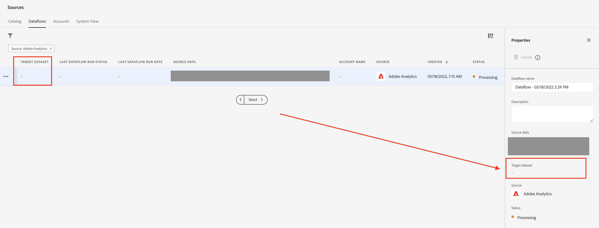

# AEP: los datos de Adobe Analytics no fluyen aunque el conector esté configurado

## Descripción

En este ejemplo, los datos de Adobe Analytics no entran, aunque se haya configurado el conector de origen.

## Resolución

Después de comprobar la configuración del flujo de datos, resulta que no tenía un conjunto de datos de destino. La falta de un conjunto de datos de destino es la causa de que el flujo de datos no ingrese ningún dato.

Cuando esté en Fuentes, simplemente vaya a la [!UICONTROL Flujos de datos] y seleccione el flujo de datos correspondiente, busque &#39;[!UICONTROL Conjunto de datos de Target]&#39; - ver a continuación:

Si está vacío, tendrá que volver a crear un nuevo flujo de datos.
