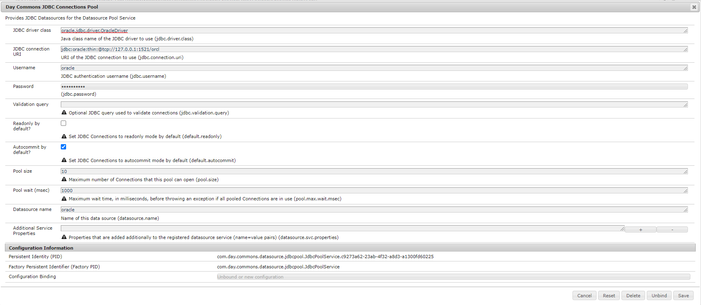

# [!DNL Oracle] Conexión de base de datos desde AEM as a cloud service

## Descripción


Los pasos siguientes contienen los requisitos [!DNL maven] dependencia, servicio OSGi y configuraciones necesarias para conectar el [!DNL Oracle] base de datos de AEM as a cloud service.


## Resolución


Para conectar la base de datos de oracle desde AEM as a cloud service, siga los siguientes pasos 3.

- <u><b>Adición [!DNL Maven] dependencia en pom</b></u>
- <u><b>AEM servicio con el que conectarse [!DNL Oracle] base de datos</b></u>
- <u><b>Configuración de OSGi</b></u>


<u><b>Adición [!DNL Maven] dependencia en pom</b></u>

<b>Paso 1:</b> Incluya lo siguiente [!DNL maven] dependencia en los proyectos principales `pom.xml`

```
dependency
                groupIdcom.oracle.database.jdbc/groupId
                artifactIdojdbc-bom/artifactId
                version21.5.0.0/version
                typepom/type
                scopeimport/scope
            /dependency
```

<b>Paso 2 : </b>Incluya lo siguiente [!DNL maven] dependencia en `pom.xml` de &quot;core&quot; y &quot;all&quot;.

```
dependency
            groupIdcom.oracle.database.jdbc/groupId
            artifactIdojdbc8/artifactId
        /dependency
        dependency
            groupIdcom.oracle.database.jdbc/groupId
            artifactIducp/artifactId
        /dependency
        dependency
            groupIdcom.oracle.database.xml/groupId
            artifactIdxdb/artifactId
        /dependency
```

<u><b>AEM servicio con el que conectarse [!DNL Oracle] base de datos</b></u>

Ejemplo de código de servicio para conectarse con la base de datos desde AEM as a cloud service, que se puede incluir en la ruta 0

0 carpeta de proyecto - principal - servicio

```
DatabaseService.java
package com.mysite.core.services; 
public interface DatabaseService {}
DatabaseServiceImpl.java
package com.mysite.core.services; 
import com.day.commons.datasource.poolservice.DataSourcePool;
import org.osgi.service.component.annotations.Activate;
import org.osgi.service.component.annotations.Component;
import org.osgi.service.component.annotations.Reference;
import org.slf4j.Logger;
import org.slf4j.LoggerFactory; 
import javax.sql.DataSource;
import java.sql.Connection; 
@Component(  service = DatabaseService.class,   immediate = true) public class DatabaseServiceImpl implements DatabaseService {   
    private final Logger LOGGER = LoggerFactory.getLogger(DatabaseService.class);   
    @Reference   private DataSourcePool dataSourcePool;   
    @Activate   public void activate() {     
        try {      
            DataSource dataSource = (DataSource) dataSourcePool.getDataSource("oracle");      
            Connection connection = dataSource.getConnection();       
            if (connection != null) {        
                if (!connection.isClosed()) {          
                    LOGGER.info("Connected with connection #4");          
                    connection.close();        
                }      
            }      
            else {        
                LOGGER.info("Connection is null");      
            }    
        } catch (Exception ex) {      
            LOGGER.error("It was not possible to get the data source: " + ex.getMessage(), ex);    
        }  
    }
}
```

<u><b>Configuración de OSGi</b></u>

<b> Paso 1: </b>Vaya a AEM configuración OSGI2 en local

<b>Paso 2: </b>Busque &quot;JDBC Connection pool&quot; y configure los siguientes valores con respecto a su base de datos (consulte la captura de pantalla para ver los valores de muestra)

- Clase de controlador JDBC
- URL de conexión JDBC
- Nombre de usuario y contraseña
- Nombre de la fuente de datos




<b>Paso 3: </b>Siga los pasos de la sección 3 y convierta la configuración de osgi en el archivo &quot;.cfg.json&quot; y añada lo mismo a la configuración de su proyecto según AEMaaCS Standard.

2 http://localhost:4502/system/console/configMgr

3 [https://experienceleague.adobe.com/docs/experience-manager-cloud-service/content/implementing/deploying/configuring-osgi.html?lang=en#generating-osgi-configurations-using-the-aem-sdk-quickstart](https://experienceleague.adobe.com/docs/experience-manager-cloud-service/content/implementing/deploying/configuring-osgi.html?lang=en#generating-osgi-configurations-using-the-aem-sdk-quickstart)
