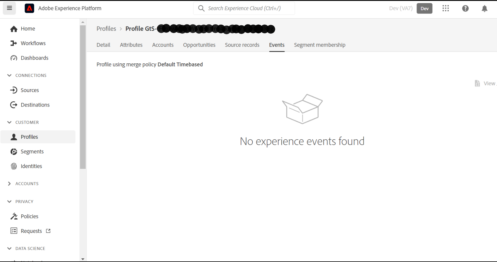

# [!UICONTROL Eventos] no son visibles para un perfil en AEP

## Descripción

No puedo ver los datos de un perfil en &quot;[!UICONTROL Eventos]&quot;.          
- He creado el esquema de eventos XDM y el conjunto de datos.
- [!UICONTROL Ingesta de datos] se realizó mediante la carga de archivos csv.

## Resolución

[!UICONTROL Eventos] muestra los datos de los eventos/solicitudes recibidas para un perfil en tiempo real, lo que no incluye la carga de archivos csv.

Las solicitudes procedentes de WebSDK/Alloy.js o a través de cualquier método de transmisión resultarían en datos en[!UICONTROL Eventos]&quot;.
