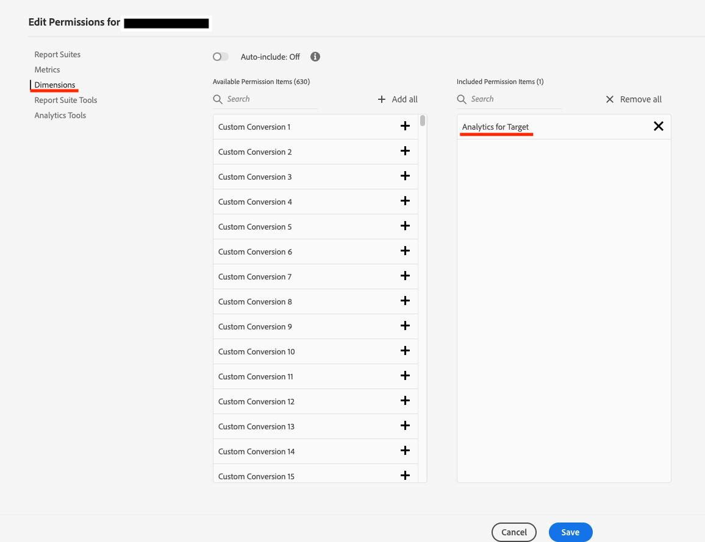

# Permiso para mostrar los Dimension de informes de A4T en Adobe Analytics

## Descripción

Los Dimension de un informe de A4T no se muestran en el Adobe Analysis Workspace. ¿Cuál es el permiso requerido?

## Resolución

1. En primer lugar, seleccione el &quot;Perfil de producto&quot; de Adobe Analytics al que desea conceder permisos mediante Admin Console.
1. Seleccione &quot;Dimension&quot; en &quot;Elementos de permisos de Adobe Analytics&quot;.

   

1. Si el permiso de dimensión &quot;[!UICONTROL Analytics para Target]&quot; se ha concedido, se mostrarán los elementos de dimensión &quot;Actividades de Target&quot;, &quot;Experiencias de Target&quot;, &quot;Experiencia de actividad de Target&quot;, &quot;Control vs. Objetivos&quot;, etc.

   

   - Informes de A4T: [!UICONTROL Informes] en [!DNL Analytics] - [!UICONTROL Dimension]
https://experienceleague.adobe.com/docs/target/using/integrate/a4t/reporting.html?lang=ja&amp;mt=false#dimensions

   - Perfiles de producto para Adobe Analytics: elementos de permiso de Adobe Analytics https://experienceleague.adobe.com/docs/analytics/admin/admin-console/permissions/product-profile.html?lang=eng#dimensions
