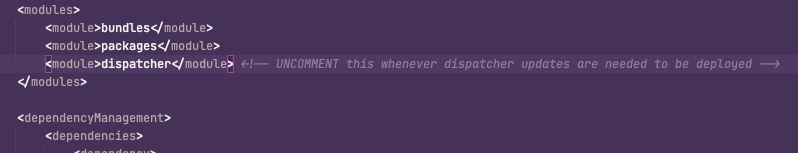

# Desactivación de la implementación de Dispatcher

## Descripción


```
During the execution of pipeline for deployment, the following error is thrown:

2022-06-21T14:16:54+0000 Deploy to instanceId=dispatcher1southafricanorth failed with errorCode=10011001 message=Failed to start Apache due to syntax error in deployed configurations. Config variables are not defined: DISP_LOG_LEVEL AH00534: httpd: Configuration error: No MPM loaded.
2022-06-21T14:16:54+0000 Failed to deploy dispatcher on instance dispatcher1southafricanorth. ActionId=671j71en7qt3mcp1mnlnjv13h9
2022-06-21T14:16:55+0000 Deploy to instanceId=dispatcher2southafricanorth failed with errorCode=10011001 message=Failed to start Apache due to syntax error in deployed configurations. Config variables are not defined: DISP_LOG_LEVEL AH00534: httpd: Configuration error: No MPM loaded.
2022-06-21T14:16:55+0000 Failed to deploy dispatcher on instance dispatcher2southafricanorth. ActionId=225ftn5ham417fmuaccae2n8ck
```


## Resolución


`Comment out or remove the dispatcher module from the main pom.xml file (see below). Then retrigger the pipeline it will skip the dispatcher changes and deploy only AEM code base over publisher and author.`


