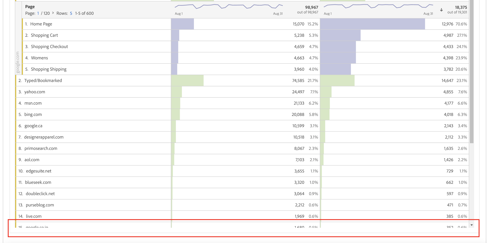
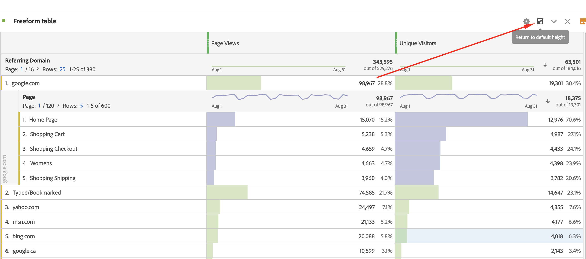

# Proyecto de Workspace truncado al programar o descargar el PDF

## Descripción

El PDF programado o descargado contiene filas truncadas como se muestra a continuación.  
 

## Resolución

En la tabla improvisada truncada, haga clic en el icono &quot;Volver a la altura predeterminada&quot;, guarde el proyecto y, a continuación, vuelva a programarlo o descargue de nuevo el proyecto de Workspace.

Causa principal: Es muy similar a un panel contraído, y al descargar un pdf contraído, no expandirá el panel.
Por el mismo motivo, es necesario expandir la tabla improvisada truncada haciendo clic en el icono &quot;Volver a la altura predeterminada&quot;. Funciona como diseño.
